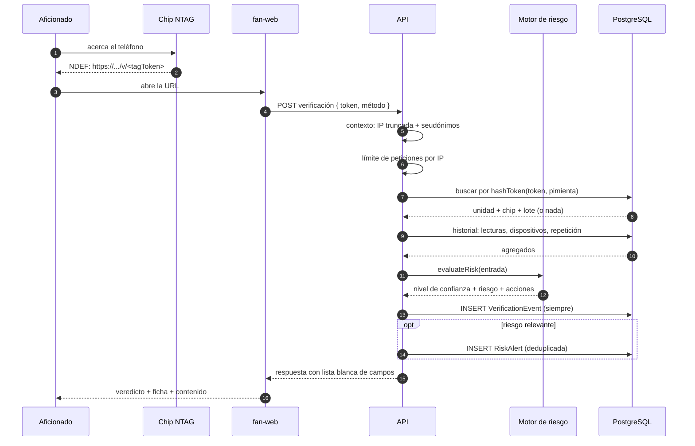
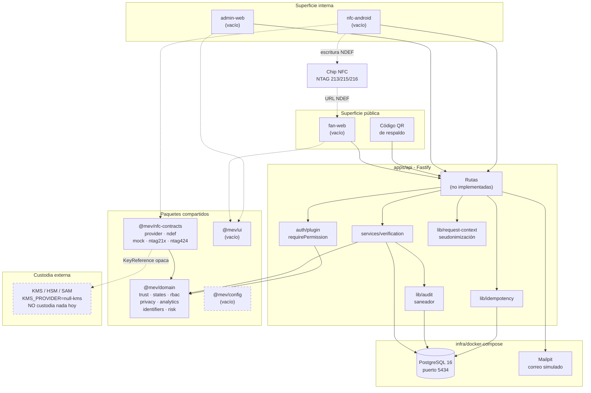

# Arquitectura

Estado del documento: describe el repositorio tal como está hoy. Cuando algo es
plan y no implementación, se dice explícitamente.

---

## 1. Qué problema resuelve el sistema

Marathon Escudo Vivo asocia un emblema con chip NFC a una unidad concreta de
jersey, y permite que cualquier persona con un teléfono obtenga un veredicto
sobre esa unidad.

El proyecto se organiza alrededor de un principio que atraviesa el código y esta
documentación:

> **Identificar no es autenticar.**
>
> Identificar es reconocer a qué unidad se refiere un identificador presentado.
> Cualquiera que copie ese identificador logra lo mismo.
>
> Autenticar es que la unidad demuestre poseer un secreto que no puede extraerse
> ni reproducirse trivialmente, mediante una operación criptográfica ejecutada
> por el propio chip.

Una URL estática, un UID legible, un código QR o una etiqueta NTAG 213 **solo
identifican**. Esa afirmación está codificada como techo de confianza en
`packages/domain/src/trust.ts` (`TRUST_CEILING_BY_METHOD`) y ninguna regla
posterior puede elevarla.

---

## 2. Componentes

| Componente | Ruta | Estado | Responsabilidad |
|---|---|---|---|
| API | `apps/api` | Implementado y probado | Fastify + Prisma. Única fuente de veredictos y único punto que toca la base de datos. |
| Web del aficionado | `apps/fan-web` | Implementado, build verificado | Destino de la URL grabada en el chip. Muestra el veredicto y el contenido dinámico. |
| Panel administrativo | `apps/admin-web` | Implementado, build verificado | Consola por rol: catálogo, producción, riesgo, soporte, privacidad. |
| App Android de planta | `apps/nfc-android` | Código fuente completo, **sin compilar** | Teléfono autorizado que ejecuta la programación NFC en la línea de producción. |
| Dominio | `packages/domain` | Implementado y probado | Reglas puras: confianza, estados, RBAC, privacidad, analítica, identificadores, motor de riesgo. Sin base de datos, sin HTTP, sin hardware. |
| Contratos NFC | `packages/nfc-contracts` | Implementado (adaptador 424 solo contrato) | Interfaz de proveedor NFC, codificación NDEF y tres implementaciones. |
| UI compartida | `packages/ui` | Implementado y probado | Componentes accesibles compartidos. Paquete de solo fuente, transpilado por Next. |
| Configuración compartida | `packages/config` | **No creado** | Ver la nota de abajo. |

`apps/api`, `apps/fan-web`, `apps/admin-web` y los tres paquetes están declarados
en los `workspaces` de `package.json`. `apps/nfc-android` no, porque es un
proyecto Gradle y no un paquete npm.

**Sobre `packages/config`.** No se creó. La configuración compartida que
justificaría ese paquete resultó ser muy poca: un único `eslint.config.mjs` en la
raíz (que ESLint 9 ya resuelve para todo el árbol) y un `tsconfig.base.json` que
cada paquete extiende por ruta relativa. Un paquete npm para dos archivos añade
un nivel de indirección sin resolver ningún problema. La validación de entorno,
que sí es lógica, vive en `apps/api/src/config.ts` porque solo la API la necesita:
las aplicaciones Next leen su configuración del mecanismo de entorno de Next.

### 2.1 Qué contiene hoy la API

```
apps/api/src/
  app.ts                  construcción de la instancia Fastify
  server.ts               arranque y apagado ordenado
  config.ts               validación de entorno con Zod
  auth/plugin.ts          requirePermission / requirePermissionInAnyScope /
                          requireUser / requireFan / optionalFan
  auth/sessions.ts        sesiones de personal y de aficionado
  lib/audit.ts            registro de auditoría + saneador de metadatos
  lib/errors.ts           errores con código estable
  lib/idempotency.ts      ejecución exactamente-una-vez por clave
  lib/passwords.ts        Argon2id + defensa contra enumeración por tiempo
  lib/request-context.ts  seudonimización de IP y de dispositivo
  plugins/db.ts           cliente Prisma como decorador
  plugins/errors.ts       manejador central de errores
  services/verification.ts  el servicio de verificación
  routes/                 public, fan, production, admin
  jobs/                   trabajos asíncronos y su ejecutor
  openapi.ts              metadatos base de la especificación
```

`app.ts` registra cuatro conjuntos de rutas, cada uno con su propio prefijo y su
propio modelo de acceso:

| Archivo | Prefijo | Acceso |
|---|---|---|
| `routes/public.ts` | `/api/v1` | Ninguno. Verificación, certificado, contenido, soporte, privacidad |
| `routes/fan.ts` | `/api/v1/fan` | Sesión de aficionado, siempre opcional para el producto |
| `routes/production.ts` | `/api/v1/production` | Sesión de operario **y** teléfono autorizado |
| `routes/admin.ts` | `/api/v1/admin` | Sesión de personal + permiso declarado por ruta |

La especificación OpenAPI se genera en modo dinámico a partir de los `schema` de
cada ruta, de modo que no pueda desviarse del código; `src/scripts/export-openapi.ts`
la materializa a disco (56 rutas en el estado actual).

Los trabajos asíncronos viven en `src/jobs/`: agregación de analítica,
materialización de métricas de campaña, aplicación de la política de retención,
caducidad de transferencias, limpieza de sesiones y detección de lotes anómalos.
No incluyen planificador propio; se invocan desde un cron del sistema. Ver
[limitaciones.md](limitaciones.md).

### 2.2 La frontera navegador / servidor del dominio

`packages/domain` expone **dos puntos de entrada**:

| Entrada | Contiene | Quién la usa |
|---|---|---|
| `@mev/domain` | Todo, incluido `identifiers.ts` (genera y hashea tokens con `node:crypto`) | API y trabajos asíncronos |
| `@mev/domain/browser` | Todo **menos** `identifiers.ts` | `packages/ui`, `fan-web`, `admin-web` |

La separación es una frontera de seguridad, no una comodidad de empaquetado:
generar el token de un chip o hashearlo con la pimienta del servidor no debe
ocurrir nunca en un navegador. Un import indebido produce un error de
compilación, no un sustituto silencioso.
`packages/domain/src/browser.test.ts` comprueba la invariante en las dos
direcciones: que ningún módulo con dependencias de Node entre en la superficie de
navegador, y que ningún módulo puro se quede fuera por olvido.

---

## 3. Decisiones técnicas y sus razones

### 3.1 Fastify en lugar de Express o NestJS

**Razón principal: generación de OpenAPI desde esquemas.** Fastify valida
peticiones y respuestas contra esquemas JSON declarados en la propia definición
de la ruta. `@fastify/swagger` deriva el documento OpenAPI de esos mismos
esquemas, de modo que el contrato publicado no puede desviarse de lo que el
servidor realmente acepta y devuelve. Con Express haría falta mantener el
esquema y la validación por separado, y se desincronizan. Con NestJS la
generación existe vía decoradores, pero a costa de un marco de inyección de
dependencias y una jerarquía de módulos que este MVP no necesita.

Efectos secundarios de la elección, todos aprovechados:

- El sistema de plugins encapsula el ámbito: un `decorate` dentro de un plugin
  no contamina la instancia raíz salvo que se use `fastify-plugin`.
- El manejador central de errores (`plugins/errors.ts`) traduce cada familia de
  error a un código estable sin que las rutas repitan lógica.
- Serializadores de log configurables por tipo, lo que permite recortar
  `/v/<token>` antes de que llegue al registro (ver [politica-logs.md](politica-logs.md)).

### 3.2 npm workspaces en lugar de pnpm

- El proyecto debe poder clonarse y arrancar con la instalación de Node que
  cualquier persona ya tiene. `npm` viene con Node; `pnpm` es un paso de
  instalación adicional y un punto de fallo más en una máquina de planta o en un
  CI ajeno.
- El grafo de dependencias del monorepo es pequeño (dos paquetes internos, tres
  aplicaciones). El ahorro de disco y la velocidad de `pnpm` no compensan el
  coste de coordinación.
- `npm` resuelve `"@mev/domain": "*"` como enlace al workspace local sin
  configuración extra.

Coste asumido: `npm` no impone el aislamiento estricto de dependencias que sí
hace `pnpm`, por lo que un paquete puede importar accidentalmente una dependencia
transitiva. Se mitiga con `typecheck` en todos los workspaces.

### 3.3 Redis sustituido por limitación de peticiones en proceso

El MVP **no despliega Redis**. La limitación de peticiones se registra en
`apps/api/src/app.ts` mediante `@fastify/rate-limit` con `global: false` y el
almacén por defecto del plugin, que es **en memoria del proceso**. Las rutas
sensibles refinan la clave; el resto no está limitado salvo declaración
explícita.

Razones:

- Una dependencia de infraestructura menos en el piloto. `infra/docker-compose.yml`
  levanta únicamente PostgreSQL y Mailpit.
- El volumen del piloto (1.000 jerseys) no justifica un almacén distribuido.
- El punto de extensión existe: `@fastify/rate-limit` acepta un `store`
  alternativo, de modo que pasar a Redis es un cambio de configuración y no un
  cambio de arquitectura.

**Consecuencia honesta:** con más de una instancia de API, cada proceso cuenta
por su cuenta y el límite efectivo se multiplica por el número de instancias.
Antes de escalar horizontalmente hay que introducir un almacén compartido. Ver
[limitaciones.md](limitaciones.md).

Valores por defecto, en `.env.example`:

| Variable | Valor | Aplica a |
|---|---|---|
| `RATE_LIMIT_VERIFY_PER_MINUTE` | 20 | Rutas públicas de verificación |
| `RATE_LIMIT_LOGIN_PER_MINUTE` | 5 | Autenticación |

### 3.4 El dominio no conoce la infraestructura

`packages/domain` no importa Prisma, ni Fastify, ni `android.nfc`. Es
determinista y se prueba sin levantar nada. Consecuencia práctica: el motor de
riesgo (`risk/engine.ts`) recibe un `RiskEvaluationInput` ya construido por la
capa de datos y devuelve un `RiskAssessment`; se puede ejercitar cualquier
escenario de ataque en una prueba unitaria sin base de datos.

### 3.5 Tres espacios de identificadores no derivables entre sí

Definido en `packages/domain/src/identifiers.ts`:

| Identificador | Forma | Entropía | Almacenamiento |
|---|---|---|---|
| `internalId` | UUID | — | En claro (clave primaria). Nunca sale de la API. |
| `publicRef` | `MEV-XXXXXXXX` (Crockford) | 2^40 | En claro. No secreto, pero no enumerable. Se muestra enmascarado. |
| `tagToken` | 32 bytes base64url | 256 bits | **Solo hash con pimienta** |
| `qrToken` | 16 bytes base64url | 128 bits | **Solo hash con pimienta**, en columna distinta |
| `transferToken` | 24 bytes base64url | 192 bits | **Solo hash con pimienta** |

El token del QR es deliberadamente distinto del token NFC: fotografiar el QR no
revela el identificador grabado en el chip.

Los tokens se hashean con SHA-256 y pimienta de servidor, no con Argon2. La
razón está en el propio archivo: son tokens de ≥128 bits generados por el
servidor, no adivinables por fuerza bruta, y un KDF lento en la ruta pública de
verificación sería un vector de denegación de servicio. Las contraseñas de
persona **sí** usan Argon2id (`lib/passwords.ts`).

### 3.6 El proveedor NFC es una interfaz, no una clase concreta

`packages/nfc-contracts/src/provider.ts` define
`NfcPersonalizationProvider`. Hay tres implementaciones:

| Proveedor | Archivo | `isSimulation` | `canProduceCryptographicProof` |
|---|---|---|---|
| Simulador | `providers/mock.ts` | `true` | `false` |
| NTAG 21x | `providers/ntag21x.ts` | `false` | `false` |
| NTAG 424 DNA | `providers/ntag424.ts` | `false` | `false` (adaptador sin implementar) |

Ninguno puede producir hoy una prueba criptográfica. La bandera del adaptador
424 describe la *implementación*, no el silicio: el chip sí es capaz, el
adaptador no.

### 3.7 Ninguna clave maestra vive en la aplicación

Regla declarada en `provider.ts`, en `schema.prisma` y en `.env.example`. El
material criptográfico se referencia con una `KeyReference` opaca
(`{ reference, custodian, version }`) y la operación que lo usa se ejecuta en el
servicio que lo custodia. Hoy `KMS_PROVIDER=null-kms`, que **no custodia nada**:
solo registra referencias. Ver [plan-gestion-claves.md](plan-gestion-claves.md).

---

## 4. Flujo de datos de una verificación, de principio a fin

Recorrido de una lectura NFC con NTAG 21x, que es el caso real hoy.

1. **Acercamiento.** El teléfono del aficionado lee el registro NDEF del chip.
   El sistema operativo abre la URL `https://<fan-web>/v/<tagToken>`. No se
   requiere aplicación instalada ni cuenta.

2. **Web del aficionado.** La página extrae el token de la ruta y lo envía a la
   API. El token nunca se envía en la cadena de consulta, que es más propensa a
   acabar en registros y en cabeceras `Referer`.

3. **Contexto de la petición.** `lib/request-context.ts` deriva:
   - `ipPrefix`: IP **truncada** (último octeto IPv4 a cero; primeros 48 bits en
     IPv6) mediante `truncateIp` de `domain/analytics.ts`.
   - `ipPseudonym`: SHA-256 de la IP ya truncada con sal rotativa.
   - `deviceFingerprint`: seudónimo de `ipPrefix | user-agent | idioma`. No se usa
     canvas, fuentes ni sensores.
   - `countryCode` si una cabecera de CDN lo aporta.
   - `language` normalizado y `lowDataMode` (cabecera `Save-Data`).

4. **Limitación de peticiones.** La ruta pública aplica su límite por IP.

5. **Resolución del token.** `services/verification.ts` calcula
   `hashToken(token, pepper)` y busca por `NfcChip.tagTokenHash` (o por
   `JerseyUnit.qrTokenHash` si el método es `QR_CODE`). Un QR caducado se trata
   como desconocido.

6. **Construcción del historial.** `buildHistory` consulta, en paralelo:
   lecturas en la última hora y en 24 horas, dispositivos e IP distintas
   (seudónimos), última ubicación aproximada conocida, y si la huella del mensaje
   autenticado ya se vio antes (detección de repetición).

7. **Evaluación de riesgo.** `domain/risk/engine.ts` aplica, en orden:
   1. Legibilidad del payload.
   2. Estados terminales: revocado, destruido, en cuarentena, previo a la venta,
      no activado. Son hechos administrativos y cortan la evaluación.
   3. Nivel base según método y criptografía. Una evidencia marcada como
      `simulated` **nunca** produce `VERIFIED`.
   4. Techo del método: un QR jamás alcanza `VERIFIED`.
   5. Señales blandas: frecuencia de lectura, dispositivos distintos, redes
      distintas. Calibradas para que ninguna aislada alcance el umbral.
   6. Geografía: país inesperado y desplazamiento imposible, con peso bajo porque
      una VPN produce el mismo patrón.
   7. Propiedad y lote: titularidades activas simultáneas, lote marcado.
   8. Consolidación: si la puntuación llega a 60, el nivel se degrada a
      `SUSPICIOUS`.

8. **Persistencia del evento.** Se crea **siempre** un `VerificationEvent`,
   también cuando el token es desconocido: de lo contrario, quien enumera no
   dejaría rastro. Se guardan `ipPseudonym`, `deviceFingerprint`, `countryCode`,
   `messageFingerprint`, códigos de razón y la marca `simulated`.

9. **Contador anti-repetición.** El contador del chip solo avanza si el
   resultado fue `VERIFIED` y el valor supera al último aceptado. Aceptarlo en
   una lectura sospechosa permitiría a un atacante empujarlo hacia adelante y
   bloquear al chip legítimo.

10. **Alerta de riesgo.** Si procede, se abre un `RiskAlert`. Se deduplica: si ya
    hay una alerta abierta para la misma unidad con los mismos códigos de razón,
    no se crea otra, para que repetir la lectura no inunde la bandeja de soporte.

11. **Respuesta pública.** `buildPublicResult` construye la respuesta con **lista
    blanca explícita de campos**. Nunca se serializa una entidad de base de datos.
    La ficha del producto solo se revela en `VERIFIED` e `IDENTIFIED_ONLY`: si se
    revelara en `REVOKED` o `NOT_ACTIVATED`, quien roba un lote de emblemas
    podría averiguar a qué modelo pertenece cada uno. La referencia pública se
    muestra enmascarada (`MEV-A1B2••••`). Las acciones internas
    (`OPEN_RISK_ALERT`, `REQUIRE_HUMAN_REVIEW`) se filtran de la respuesta.

12. **Mensaje al aficionado.** Se deriva del **nivel de confianza**, nunca del
    código de razón interno. Entregar el código de razón sería darle a un
    falsificador un canal de diagnóstico sobre qué control falló.



---

## 5. Diagrama de componentes



Los bloques con borde discontinuo son los que **no custodian nada todavía**:
`packages/config` (la validación de entorno vive hoy en `apps/api/src/config.ts`)
y el custodio de claves, que en el MVP es un marcador de posición
(`KMS_PROVIDER=null-kms`) y no guarda ninguna clave.

`apps/nfc-android` sí existe como código fuente completo, pero **no se compiló**:
el entorno de construcción no tiene Android SDK ni Gradle. Ver
[limitaciones.md](limitaciones.md).

---

## 6. Fronteras de confianza

| Frontera | Qué la cruza | Qué nunca la cruza |
|---|---|---|
| Chip → teléfono | Registro NDEF, UID, mensaje autenticado (futuro) | Claves |
| Teléfono de planta → API | APDU ya construidos por el servidor, resultados de escritura, jobId | Claves maestras, claves diversificadas |
| API → custodio de claves | `KeyReference` opaca | La clave sale del custodio |
| API → web del aficionado | Lista blanca de campos, referencia enmascarada, mensaje derivado del nivel | Códigos de razón internos, UID, token en claro, entidades de base de datos |
| API → patrocinador | Contadores agregados precalculados | Cualquier fila con sujeto |

La regla más importante del modelo NTAG 424 DNA previsto: **el teléfono es un
túnel**. Recibe APDU ya cifrados por el custodio y los retransmite; la validación
del mensaje autenticado ocurre en el servidor. Ver
[guia-ntag424-dna.md](guia-ntag424-dna.md).

---

## 7. Configuración de entorno relevante para la arquitectura

`apps/api/src/config.ts` valida el entorno con Zod y **el proceso no arranca** si
falta una variable. En producción hay dos barreras duras adicionales:

1. Si `SESSION_SECRET`, `TOKEN_HASH_PEPPER` o `ANALYTICS_IP_SALT` conservan el
   prefijo `dev-only-insecure`, el arranque falla.
2. Si `NFC_PROVIDER=mock`, el arranque falla: el simulador no produce
   autenticación real.

---

## 8. Documentos relacionados

- [modelo-datos.md](modelo-datos.md)
- [modelo-amenazas.md](modelo-amenazas.md)
- [plan-gestion-claves.md](plan-gestion-claves.md)
- [guia-ntag424-dna.md](guia-ntag424-dna.md)
- [limitaciones.md](limitaciones.md)
