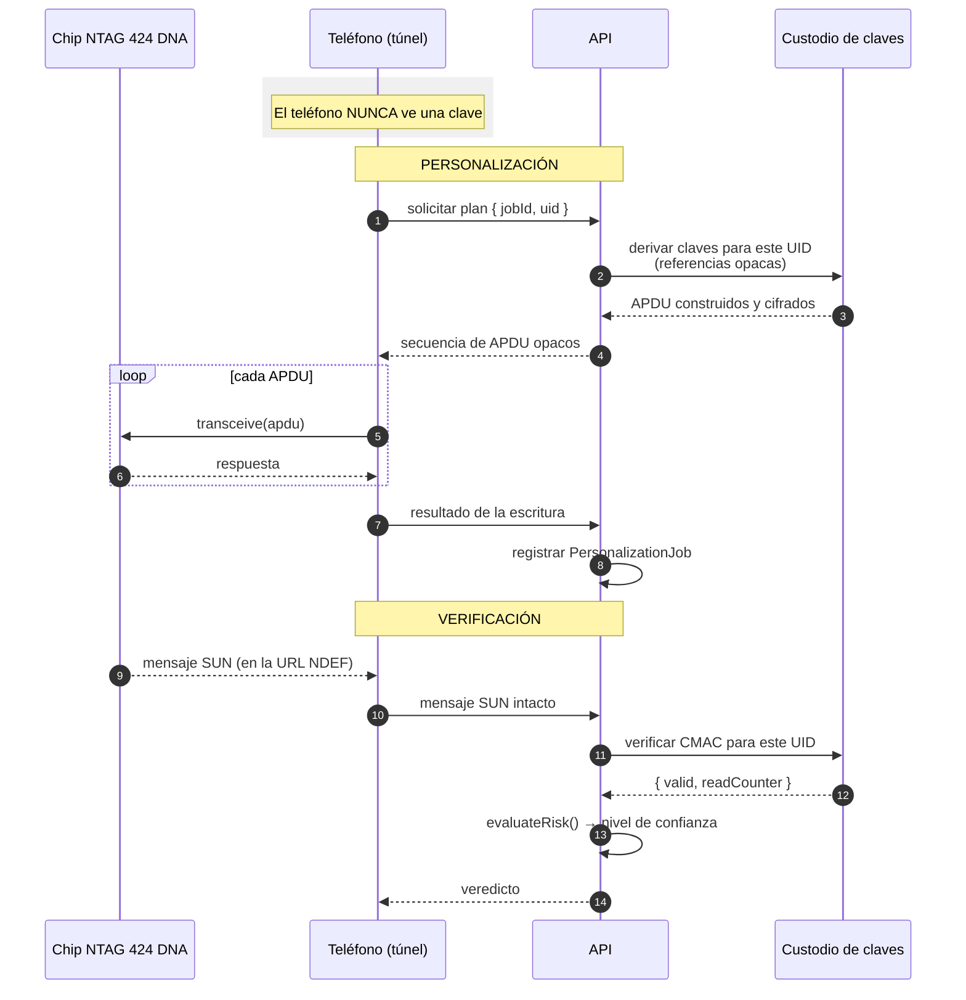

# Guía de integración de NTAG 424 DNA

Cómo completar la integración que hoy es solo un contrato.

---

## 0. Estado actual

`packages/nfc-contracts/src/providers/ntag424.ts` contiene un adaptador que
**declara la forma de la integración y nada más**. Todos los métodos relevantes
lanzan `NOT_IMPLEMENTED`.

Esto es deliberado, y la razón está escrita en el propio archivo:

> Escribir aquí comandos inventados sería peor que no escribir nada: produciría un
> adaptador que parece funcional, pasa una revisión superficial y destruye
> inventario en la primera prueba real.

La bandera `capabilities.canProduceCryptographicProof` está en `false`. **Describe
la implementación, no el silicio.** El chip sí es capaz; el adaptador no lo es.
Cambiarla a `true` sin una implementación validada contra hardware haría que el
motor de riesgo emitiera `VERIFIED` sin ninguna prueba detrás.

### Trabajo pendiente declarado en el código

`NTAG424_PENDING_WORK` en `providers/ntag424.ts` lo enumera de forma consumible
por la interfaz y por esta documentación:

| Operación | Bloqueada por |
|---|---|
| `inspectTag` | Comandos GetVersion / GetFileSettings sin validar |
| `personalizeSecureTag` | ChangeKey y ChangeFileSettings; requiere custodio de claves y hardware |
| `verifyPersonalization` | Depende de `personalizeSecureTag` |
| `lockAllowedAreas` | Configuración irreversible; requiere hardware |
| `readVerificationPayload` | Lectura del mensaje SUN; requiere hardware para validar el formato |
| `runPostPressCheck` | Depende de `readVerificationPayload` |
| `validateOriginality` | Clave pública de originalidad de NXP no disponible en el repositorio |

---

## 1. Por qué merece la pena

Es la palanca de mayor impacto del proyecto. Del
[modelo de amenazas](modelo-amenazas.md):

| Amenaza | Riesgo hoy | Riesgo con NTAG 424 DNA integrado |
|---|---|---|
| 2 — Clonación de la etiqueta | **ALTO** | Reducido sustancialmente |
| 1 — Copia de la URL | **ALTO** | Reducido: la URL cambia en cada lectura |
| 3 — Repetición | No aplicable (nada que repetir) | Controlado por contador y huella de mensaje |
| 10 — Chip falsificado | **ALTO** | Reducido: un chip no NXP no produce un CMAC válido |
| 6 — Trasplante del emblema | **ALTO** | **Sin cambio.** Un chip trasplantado produce un mensaje válido |

La última fila importa tanto como las otras cuatro: el cambio de hardware no
resuelve el trasplante, y la comunicación pública debe seguir siendo precisa.

Además, es el único camino para que el sistema pueda emitir `VERIFIED`:
`supportsCryptographicAuthentication()` en `domain/trust.ts` devuelve `true`
solo para `NTAG424DNA`, y `TRUST_CEILING_BY_METHOD` solo concede el techo
`VERIFIED` al método `NFC_CRYPTOGRAPHIC`.

---

## 2. Qué se necesita antes de escribir una línea de código

### 2.1 Hardware

| Elemento | Detalle |
|---|---|
| Etiquetas NTAG 424 DNA | Cantidad suficiente para asumir pérdidas. **Cada error de configuración deja un chip inutilizable de forma permanente.** Se recomienda un lote de desarrollo separado del lote de producción |
| Teléfono Android con NFC | Para las pruebas de campo. Los modelos concretos y su comportamiento deben verificarse con hardware: **no se dan por supuestos aquí** |
| Lector USB de sobremesa (opcional pero recomendado) | Permite iterar sin depender de la app Android. El contrato `TagTransport` ya aísla el transporte, así que añadir un lector USB es una implementación nueva sin tocar el dominio |
| Emblemas de prueba con chip montado | Para los ensayos de [pruebas-fisicas.md](pruebas-fisicas.md) |

### 2.2 Documentación oficial de NXP

**Se distribuye bajo registro.** Hay que solicitarla al fabricante o al
distribuidor:

- Hoja de datos del producto NTAG 424 DNA.
- La nota de aplicación referenciada en el código como **AN12196**, sobre el
  conjunto de comandos y el uso de SUN.

> **No inventar nada de este material.** Números de clave, identificadores de
> fichero, estructura de los ajustes SDM, offsets del mensaje, longitudes,
> secuencia de autenticación: todo debe salir de la documentación oficial y
> validarse contra hardware. Si un dato no se tiene con certeza, **se verifica con
> el fabricante antes de escribir código**.

### 2.3 Custodio de claves operativo

Un KMS (piloto) o HSM/SAM (producción) aprovisionado, con la clave maestra de
aplicación generada mediante la ceremonia de
[plan-gestion-claves.md](plan-gestion-claves.md), sección 6.

Sin custodio no se puede empezar: el diseño no admite una clave "provisional en
el código", ni siquiera para pruebas, porque eso normaliza el patrón que el
proyecto prohíbe.

### 2.4 Personas

| Función | Por qué |
|---|---|
| Custodio de clave | Autoriza la generación; no ejecuta personalización |
| Integrador | Escribe el código; no debe tener acceso al valor de ninguna clave |
| Validador | Comprueba cada paso contra hardware antes de dar por bueno el siguiente |

---

## 3. El contrato ya definido

### 3.1 La interfaz común

`Ntag424DnaProvider` implementa `NfcPersonalizationProvider`
(`packages/nfc-contracts/src/provider.ts`), igual que el simulador y el proveedor
NTAG 21x. Las once operaciones son:

| Operación | Qué debe hacer en NTAG 424 DNA |
|---|---|
| `detectTag()` | Ya implementada: devuelve lo que reportó la pila NFC. Es la única operación que no toca lógica segura |
| `inspectTag()` | Leer versión y ajustes de fichero para saber si el chip está virgen o ya personalizado |
| `validateOriginality()` | Verificar la firma de originalidad del silicio, si el chip la expone. Hoy devuelve `notSupported: true` |
| `preparePersonalization()` | Comprobar localmente que el plan es ejecutable **antes de emitir una sola escritura** |
| `writeNdef()` | **Rechaza a propósito.** Ver 3.4 |
| `personalizeSecureTag()` | **Punto de integración 1.** Ver 3.2 |
| `verifyPersonalization()` | Releer y comprobar que el chip quedó como se pretendía |
| `lockAllowedAreas()` | Bloquear la configuración. Irreversible |
| `readVerificationPayload()` | **Punto de integración 2.** Ver 3.3 |
| `runPostPressCheck()` | Comprobación posterior al termosellado |

### 3.2 Punto de integración 1: `personalizeSecureTag()`

El código lo marca con `// PUNTO DE INTEGRACION 1` y describe la implementación
prevista:

```ts
const apdus = await this.options.personalizationService.buildPersonalizationApdus({...})
for (const apdu of apdus) await this.options.transport.transceive(apdu)
```

Lo que significa cada parte:

- `buildPersonalizationApdus` vive en el **servidor**, no en el teléfono. Es un
  método de `SecureElementPersonalizationService`, y el comentario del contrato es
  explícito: *"El teléfono NUNCA implementa esta interfaz: solo la consume por
  red."*
- Recibe `{ jobId, uid, keyReferences }`. Ninguno de los tres es material
  criptográfico: `jobId` es el identificador de idempotencia, `uid` identifica el
  chip para la diversificación, y `keyReferences` son punteros opacos al custodio.
- Devuelve `Uint8Array[]`: la secuencia de APDU **ya construida y cifrada por el
  custodio de claves**, que el teléfono retransmite tal cual.
- El bucle en el adaptador se limita a `transceive`. No interpreta, no decide, no
  deriva nada.

### 3.3 Punto de integración 2: `readVerificationPayload()`

Marcado con `// PUNTO DE INTEGRACION 2`. La implementación prevista:

> Leer el fichero NDEF con el mensaje SUN y devolverlo **INTACTO** en
> `authenticatedMessage`. **No interpretarlo aquí.**

El tipo `VerificationPayload` (`provider.ts`) tiene exactamente los campos
necesarios:

```ts
interface VerificationPayload {
  token: string | null;
  authenticatedMessage: string | null;  // el mensaje SUN, sin tocar
  readCounter: number | null;
  simulated: boolean;                   // false en un proveedor real
}
```

La validación del CMAC y el descifrado del contador ocurren en el servidor,
mediante `verifyAuthenticatedMessage({ uid, message })`, que devuelve
`{ valid, readCounter }`. El comentario del contrato lo fija:

> *"El teléfono nunca decide si una firma es válida."*

### 3.4 Por qué `writeNdef()` rechaza

Un NTAG 424 DNA admite escritura NDEF simple. Hacerlo por esa vía sin configurar
SUN produciría **una etiqueta cara con la seguridad de una NTAG 213**. El método
devuelve `OPERATION_NOT_PERMITTED` con ese mensaje, para que nadie lo haga por
accidente. Ese rechazo debe mantenerse.

---

## 4. La frontera de confianza

Esta es la decisión arquitectónica que no se negocia.



### 4.1 Las tres reglas

1. **El teléfono es un túnel.** Recibe bytes opacos y los retransmite. No deriva
   claves, no valida firmas, no decide nada de seguridad. Si el teléfono se
   compromete por completo, el atacante obtiene la capacidad de personalizar los
   chips que tenga físicamente delante durante la ventana de sesión (4 horas), y
   nada más: no obtiene la clave.

2. **La verificación del mensaje autenticado ocurre en el servidor.** Un cliente
   que decide si una firma es válida es un cliente que puede mentir. El contrato
   `verifyAuthenticatedMessage` está del lado del servidor por diseño.

3. **La clave nunca sale del custodio.** Ni cifrada, ni fragmentada, ni "solo para
   esta operación". Las operaciones que necesitan la clave se ejecutan **dentro**
   del KMS/HSM/SAM.

### 4.2 Qué cruza cada frontera

| Frontera | Cruza | No cruza |
|---|---|---|
| Custodio → API | APDU construidos, resultado de verificación `{ valid, readCounter }` | La clave, en ninguna forma |
| API → teléfono | APDU opacos, `jobId`, URI a grabar | Claves, referencias utilizables sin credenciales |
| Teléfono → chip | APDU tal cual | — |
| Chip → teléfono | Mensaje SUN, UID, respuestas de APDU | — |
| Teléfono → API | Mensaje SUN **intacto**, resultado de escritura | Un veredicto de validez |
| API → aficionado | Nivel de confianza, ficha con lista blanca | Códigos de razón, UID, mensaje SUN, contador |

---

## 5. Pasos ordenados de la integración

Cada paso se valida contra hardware antes de empezar el siguiente. Un paso que no
se puede verificar no se da por bueno.

### Fase A — Preparación

**A1. Obtener y leer la documentación oficial de NXP.**
Salida: conocimiento verificado de la estructura de claves, los ficheros y el
formato del mensaje SUN. No se escribe código en este paso.

**A2. Aprovisionar el custodio de claves.**
KMS con la clave maestra de aplicación generada por ceremonia
([plan-gestion-claves.md](plan-gestion-claves.md), sección 6).
Criterio de salida: una derivación de prueba con UID ficticio es determinista y
reproducible, y la clave está marcada como no exportable.

**A3. Montar un banco de pruebas.**
Lector (USB o teléfono) + etiquetas de desarrollo + registro de cada operación.
Criterio de salida: se puede leer el UID y la versión de un chip virgen, de forma
repetible.

### Fase B — Lectura, sin escribir nada

**B1. Implementar `inspectTag()`.**
Solo lectura. Debe distinguir un chip virgen de uno ya personalizado. Rellena
`TagInspection`: `userMemoryBytes`, `readOnly`, `hasNdefMessage`, `currentUri`,
`versionBytes`.
Criterio de salida: sobre 10 chips vírgenes y 0 personalizados, el resultado es
consistente y no altera ningún chip. **Ningún chip queda inutilizable.**

**B2. Implementar `validateOriginality()`.**
Requiere la clave pública de originalidad de NXP, suministrada por configuración y
**nunca versionada**. Si falta, debe seguir devolviendo `notSupported: true`, como
hace hoy el proveedor NTAG 21x: es preferible reportar honestamente a devolver un
`verified: true` vacío.
Criterio de salida: sobre chips auténticos devuelve `verified: true`; sobre un
chip no NXP (si se consigue uno) devuelve `verified: false`; sin clave configurada
devuelve `notSupported: true`.

### Fase C — Verificación antes que personalización

Este orden es deliberado. Se implementa primero la lectura del mensaje
autenticado, aunque haya que configurar el chip a mano con las herramientas del
fabricante, porque así se valida el formato del mensaje y el verificador de
servidor **antes** de escribir código que pueda destruir chips.

**C1. Implementar el verificador de servidor.**
`verifyAuthenticatedMessage({ uid, message })` en el lado servidor, apoyado en el
custodio. Debe devolver `{ valid, readCounter }`.
Criterio de salida: sobre vectores de prueba de la documentación oficial, el
verificador acierta; sobre un mensaje alterado en un solo bit, devuelve
`valid: false`.

**C2. Implementar `readVerificationPayload()`.**
Devuelve el mensaje SUN **intacto**. No lo interpreta. `simulated: false`.
Criterio de salida: leer el mismo chip dos veces produce dos mensajes distintos
(es la propiedad que hace útil a SUN), y el contador crece.

**C3. Conectar con el motor de riesgo.**
En `services/verification.ts`, la construcción de `crypto` está hoy fijada:

```ts
// El adaptador NTAG 424 DNA no esta implementado, asi que hoy
// ninguna ruta produce `signatureValid: true` con `simulated: false`.
// Cuando exista, la validacion del CMAC ocurrira aqui, en servidor.
signatureValid: false,
```

Aquí es donde se sustituye ese `false` por el resultado del verificador. Solo
entonces el motor puede emitir `VERIFIED`.
Criterio de salida: un mensaje válido produce `VERIFIED`; el mismo mensaje
repetido produce `MESSAGE_ALREADY_SEEN` (80 pts) y degrada a `SUSPICIOUS`; un
contador no creciente produce `COUNTER_NOT_INCREASING` (80 pts).

### Fase D — Personalización

**D1. Implementar `buildPersonalizationApdus()` en el servidor.**
Deriva las claves diversificadas a partir de la maestra custodiada y del UID, y
construye la secuencia de APDU **dentro del ámbito del custodio**.
Criterio de salida: la secuencia es determinista para un mismo `(jobId, uid,
keyReferences)`; ninguna clave aparece en un registro; el saneador de auditoría no
tiene nada que redactar porque nada sensible pasa por él.

**D2. Implementar `preparePersonalization()`.**
Comprobaciones locales **antes** de emitir una sola escritura: el chip es del tipo
esperado, no está ya personalizado, no está bloqueado, el plan trae las
referencias de clave necesarias.
Criterio de salida: sobre un chip ya personalizado devuelve `ok: false` sin tocar
nada.

**D3. Implementar `personalizeSecureTag()`.**
El bucle de `transceive`, y nada más.
Criterio de salida: **sobre un solo chip de sacrificio**, la personalización
completa. Solo tras verificarla se repite sobre un segundo chip. No se pasa a
volumen hasta tener 10 chips personalizados y verificados.

**D4. Implementar `verifyPersonalization()`.**
Relectura y comparación con lo pretendido.
Criterio de salida: detecta correctamente un chip bien personalizado y uno
intervenido a medias.

**D5. Poner `canProduceCryptographicProof: true`.**
**Este es el último paso de la fase, no el primero.** Solo se cambia cuando D1–D4
están validados contra hardware. Cambiarlo antes hace que el motor de riesgo emita
`VERIFIED` sin prueba detrás.

### Fase E — Bloqueo y cierre

**E1. Implementar `lockAllowedAreas()`.**
**Irreversible.** Requiere confirmación explícita en la app del operario, tal como
declara `LockPlan.lockConfiguration`.
Criterio de salida: sobre chips de sacrificio, el bloqueo funciona y un intento
posterior de reescritura falla. Se documenta cuántos chips se perdieron en la
validación.

**E2. Implementar `runPostPressCheck()`.**
Depende de C2. Devuelve `readable`, `contentIntact`, `signalStrength`.
Sobre `signalStrength`: el proveedor NTAG 21x lo deja en `null` con el comentario
*"Android no expone RSSI para NFC. Se deja null en lugar de inventarlo."* **Si la
plataforma sigue sin exponerlo, debe seguir siendo `null`.** No se inventa una
métrica.

**E3. Ejecutar los ensayos físicos.**
[pruebas-fisicas.md](pruebas-fisicas.md), con NTAG 424 DNA montado en emblemas
reales. **Ninguno se ha ejecutado todavía.**

### Fase F — Puesta en marcha

**F1.** Habilitar `NFC_PROVIDER=ntag424dna` en un entorno de preproducción.
**F2.** Producir un lote piloto reducido y seguir el
[protocolo de programación](protocolo-programacion.md).
**F3.** Revisar los `VerificationEvent` del lote: ¿cuántos alcanzan `VERIFIED`?,
¿cuántos fallan y por qué?
**F4.** Solo entonces, producción.

---

## 6. Criterios de aceptación de la integración completa

La integración se considera terminada cuando **todos** estos criterios se cumplen
y están documentados con evidencia.

### 6.1 Criptografía y frontera de confianza

- [ ] Un mensaje SUN válido produce nivel de confianza `VERIFIED`.
- [ ] El mismo mensaje presentado dos veces produce `MESSAGE_ALREADY_SEEN` y
      degrada el nivel.
- [ ] Un mensaje con un bit alterado produce `CRYPTO_SIGNATURE_INVALID` y abre una
      alerta de riesgo.
- [ ] Un contador que no crece produce `COUNTER_NOT_INCREASING`.
- [ ] Una lectura del mismo chip nunca produce dos veces la misma URL.
- [ ] **Ninguna clave aparece en el código, en un recurso de la app, en la base de
      datos ni en un registro.** Verificado por inspección y por escaneo
      automático.
- [ ] La app Android no contiene ninguna función de derivación ni de validación de
      firma.
- [ ] Desactivar el custodio de claves hace que la verificación falle de forma
      segura (degradando el nivel), no que lo acepte.
- [ ] Un proveedor simulado sigue produciendo `simulated: true` y **nunca**
      `VERIFIED`.

### 6.2 Personalización

- [ ] 100 chips consecutivos personalizados y verificados sin pérdidas.
- [ ] Un fallo de comunicación a mitad de la personalización deja el chip en un
      estado del que se puede reintentar, o en cuarentena, nunca en un estado
      ambiguo.
- [ ] El reintento con la misma clave de idempotencia no duplica el trabajo
      (`PersonalizationJob.idempotencyKey`).
- [ ] La transición de estados del chip (`domain/states.ts`) se respeta en todo el
      recorrido.
- [ ] `preparePersonalization()` rechaza un chip ya personalizado sin escribir.

### 6.3 Gestión de claves

- [ ] Clave maestra generada por ceremonia documentada y firmada.
- [ ] Clave marcada como no exportable en el custodio.
- [ ] `NfcKeyReference` contiene únicamente referencias opacas, verificado sobre la
      base de datos real.
- [ ] Rotación probada: una clave de versión 2 conviven con chips de versión 1, y
      ambos verifican correctamente.
- [ ] Procedimiento de compromiso ensayado en simulacro.

### 6.4 Físico

- [ ] Ensayos de [pruebas-fisicas.md](pruebas-fisicas.md) ejecutados y
      documentados, con el formulario de resultados completo.
- [ ] Tasa de fallo post-termosellado por debajo del umbral acordado.
- [ ] Lectura verificada en el rango de modelos de teléfono que el piloto debe
      soportar. **Ese rango se determina con hardware real, no se supone.**

### 6.5 Documentación

- [ ] Esta guía actualizada para reflejar lo implementado.
- [ ] `NTAG424_PENDING_WORK` vaciado o reducido a lo que realmente siga pendiente.
- [ ] [modelo-amenazas.md](modelo-amenazas.md) reevaluado: los riesgos residuales
      de las amenazas 1, 2, 3 y 10 deben bajar, y el de la 6 debe seguir en ALTO.
- [ ] [limitaciones.md](limitaciones.md) actualizado.

---

## 7. Sobre la firma de originalidad

Aplica tanto a NTAG 21x como a NTAG 424 DNA, y el razonamiento está en
`packages/nfc-contracts/src/provider.ts`, en el tipo `OriginalityResult`.

NXP publica una firma ECC de originalidad generada en fábrica sobre el UID.
Verificarla comprueba que el **silicio** salió de una fábrica NXP.

**No comprueba:**

- Que el contenido no haya sido copiado a otra etiqueta NXP legítima.
- Que ese chip concreto sea el que Marathon programó.
- Que el emblema sea el original.
- Que la prenda sea auténtica.

Por eso su resultado **alimenta el riesgo pero nunca produce por sí solo
`VERIFIED`**. El tipo separa deliberadamente tres estados —`verified`,
`notSupported`, `simulated`— para que "no se pudo comprobar" nunca se confunda con
"es auténtico".

La clave pública de originalidad de NXP se obtiene del fabricante y **no se
versiona en este repositorio**. El campo de configuración ya existe:
`Ntag21xProviderOptions.nxpOriginalityPublicKey`.

---

## 8. Lo que esta guía no dice, y por qué

No contiene:

- Comandos APDU concretos, ni sus bytes.
- Números de clave, identificadores de fichero ni offsets.
- La estructura exacta de los ajustes SDM.
- El formato exacto del mensaje SUN.
- Longitudes de campo ni valores de configuración.
- Compatibilidad de modelos concretos de teléfono.

Todo eso debe salir de la documentación oficial de NXP y validarse contra
hardware. Escribirlo aquí de memoria o por inferencia produciría un documento que
parece autoritativo y que destruye inventario. Si un dato no se tiene con
certeza, **se verifica con el fabricante**.

---

## Documentos relacionados

- [plan-gestion-claves.md](plan-gestion-claves.md)
- [modelo-amenazas.md](modelo-amenazas.md)
- [protocolo-programacion.md](protocolo-programacion.md)
- [pruebas-fisicas.md](pruebas-fisicas.md)
- [piloto-a-produccion.md](piloto-a-produccion.md)
