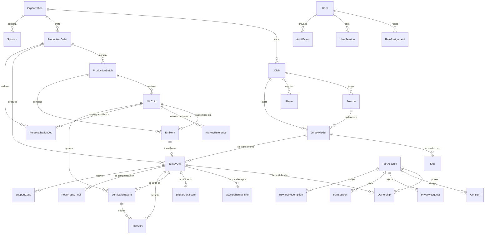
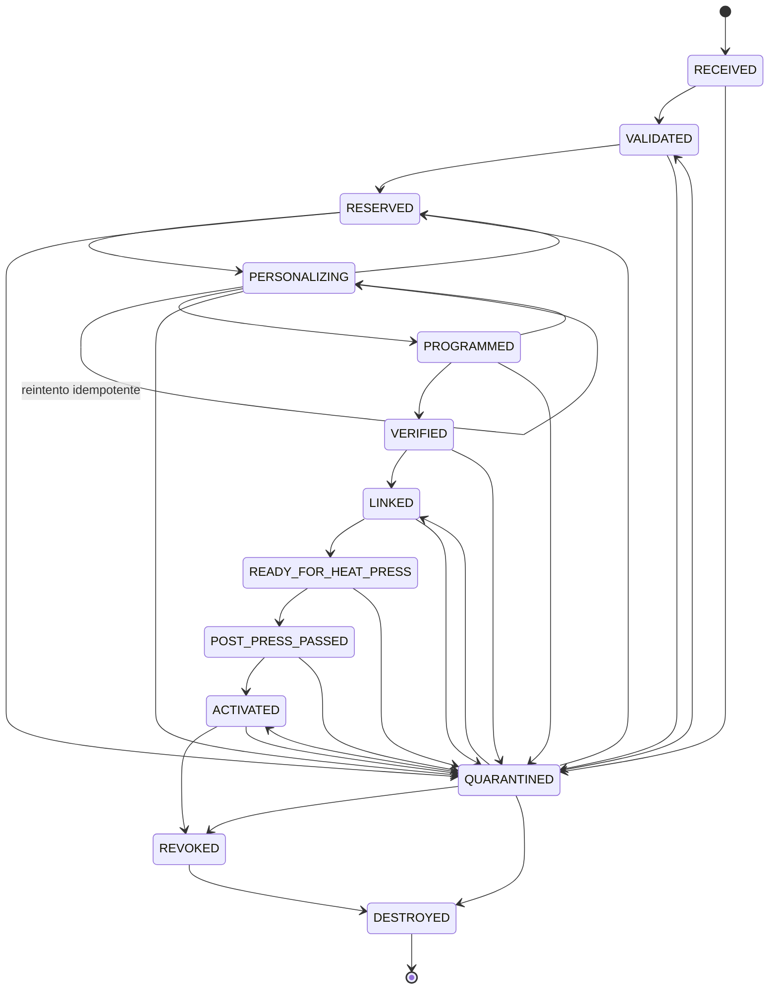
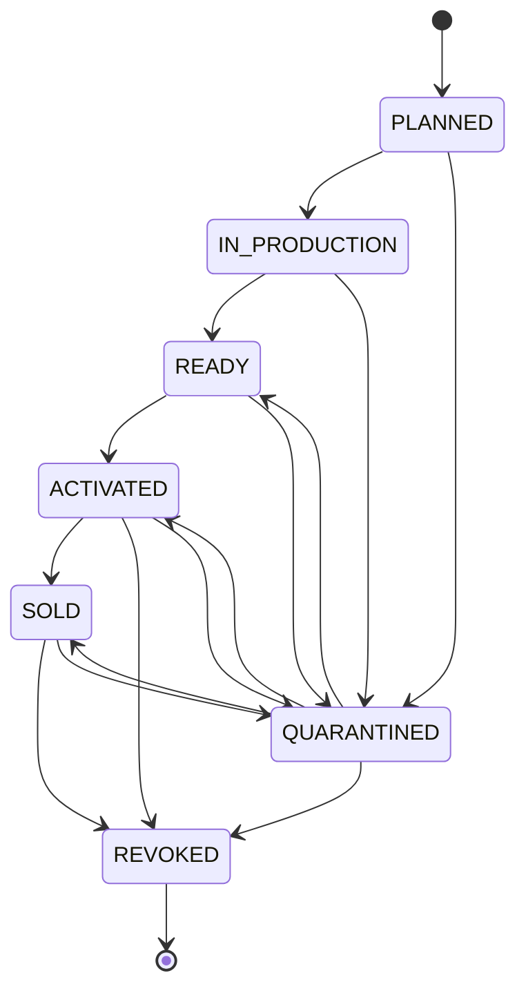

# Modelo de datos

Fuente: `apps/api/prisma/schema.prisma` y las migraciones bajo
`apps/api/prisma/migrations/`. Base de datos: PostgreSQL 16.

---

## 1. Reglas que gobiernan el esquema

Están declaradas en la cabecera del propio `schema.prisma` y se aplican sin
excepción:

1. **En este esquema no se almacena ninguna clave maestra NFC.** La tabla
   `NfcKeyReference` guarda únicamente una referencia opaca al custodio
   (KMS/HSM/SAM). Ver [plan-gestion-claves.md](plan-gestion-claves.md).
2. **Los tokens de alta entropía se guardan solo como hash con pimienta de
   servidor.** Afecta a `tagToken`, `qrToken`, `transferToken` y a los tokens de
   sesión. El valor en claro existe durante la programación y se descarta.
3. **El personal interno y los aficionados no comparten tabla ni sesión.**
   `User` y `FanAccount` están separados a propósito.
4. **`AuditEvent` es solo-anexar.** La aplicación nunca actualiza ni borra filas.

---

## 2. Diagrama entidad-relación de las entidades centrales



La cadena que conecta una lectura con un producto es
`NfcChip → Emblem → JerseyUnit → JerseyModel → Club/Season`. Cada eslabón es
uno-a-uno opcional, lo que permite representar un chip recibido pero aún no
montado, un emblema sin unidad asignada y una unidad planificada sin emblema.

---

## 3. Entidades

### 3.1 Identidad y acceso

#### `User`
Personal interno: panel administrativo y app Android de planta.

| Campo | Notas |
|---|---|
| `email` | Único |
| `passwordHash` | Argon2id. Nunca se registra ni se devuelve |
| `active` | Desactivar debe ir acompañado de revocar sesiones |
| `mfaEnabled`, `mfaSecretRef` | Preparado para fase 2. El secreto irá **cifrado con clave de KMS**, no en claro |
| `deletedAt` | Borrado lógico |

Los aficionados **no** son `User`. La separación evita que una vulnerabilidad en
la superficie pública toque la tabla del personal, y que una consulta descuidada
del panel devuelva datos de titulares.

#### `RoleAssignment`
Un usuario puede tener varias asignaciones. Cada una es `(rol, tipo de ámbito,
id de ámbito)`.

- Único: `(userId, role, scopeType, scopeId)`.
- `scopeId` es `null` cuando `scopeType = GLOBAL`.

La evaluación está en `packages/domain/src/rbac.ts` (`hasAccess`). Ver
[matriz-roles-permisos.md](matriz-roles-permisos.md).

#### `UserSession`
| Campo | Notas |
|---|---|
| `tokenHash` | Único. El token en claro solo existe en el cliente |
| `deviceId` | Presente solo en sesiones de la app Android |
| `lastIpPrefix` | IP **truncada**, no completa |
| `revokedAt` | Revocación explícita |

Duraciones en `apps/api/src/auth/sessions.ts`: panel 12 h, dispositivo de planta
**4 h** (es un dispositivo compartido y expuesto; si se extravía, la ventana de
abuso debe ser pequeña), aficionado 30 días.

#### `FanSession`
Equivalente para aficionados. `tokenHash` único, `expiresAt`, `revokedAt`.

---

### 3.2 Organización y catálogo

| Entidad | Unicidad relevante | Notas |
|---|---|---|
| `Organization` | `name` | `country` por defecto `EC` |
| `Club` | `slug` | Colores e imagen de escudo |
| `Season` | `(clubId, name)` | Fechas de inicio y fin |
| `Player` | — | `shirtNumber` alimenta el contenido dinámico |
| `JerseyModel` | `(clubId, seasonId, name, edition)` | `edition`: HOME, AWAY, THIRD, GOALKEEPER, SPECIAL, COMMEMORATIVE |
| `Sku` | `code` | **Clave de correlación con la tienda electrónica.** `priceCents` es entero: Ecuador usa USD y no se usan flotantes para dinero |

Ver [integracion-tienda.md](integracion-tienda.md) sobre el papel del `Sku`.

---

### 3.3 Producción

#### `ProductionOrder`
`code` único (p. ej. `OP-2026-0001`). Estados `DRAFT → OPEN → IN_PROGRESS →
PAUSED / COMPLETED / CANCELLED`, con las transiciones válidas declaradas en
`domain/states.ts` (`PRODUCTION_ORDER_TRANSITIONS`). `COMPLETED` y `CANCELLED`
son terminales.

#### `ProductionBatch`
Lote de chips recibido del proveedor. `code` único, `supplierName`,
`supplierLotRef`. El campo `flagged` lo marca control de calidad o el motor de
riesgo, y **el motor de riesgo lo lee en cada verificación**: un lote marcado
suma 20 puntos de riesgo (`BATCH_ANOMALY_FLAGGED`).

#### `ProgrammingStation` y `AuthorizedDevice`
Puesto físico y teléfono autorizado. `AuthorizedDevice.deviceId` es único.
`attestationRef` está **preparado para Play Integrity API en fase 2 y hoy no se
verifica**: la autorización del dispositivo es una lista en base de datos, no una
atestación criptográfica. Ver el vector "dispositivo de producción comprometido"
en [modelo-amenazas.md](modelo-amenazas.md).

---

### 3.4 Chip, emblema y unidad

#### `NfcChip`
| Campo | Restricción | Notas |
|---|---|---|
| `uid` | **Único** | Dato sensible. Requiere permiso `chips:read` para verlo completo. La unicidad impide registrar dos veces el mismo chip físico |
| `tagTokenHash` | **Único** | Hash del token grabado. El token en claro no se guarda |
| `chipType` | — | NTAG213/215/216/424DNA/UNKNOWN |
| `state` | — | 13 estados, ver 4.1 |
| `lastAcceptedCounter` | — | Base del control anti-repetición |
| `programmedAt`, `verifiedAt`, `activatedAt`, `revokedAt` | — | Marcas de tiempo para auditoría |

#### `NfcKeyReference`
**Aquí no hay ninguna clave. Solo el puntero al custodio.**

| Campo | Contenido |
|---|---|
| `keyRole` | `APP_MASTER`, `SDM_META_READ`, `SDM_FILE_READ`, etc. |
| `reference` | Identificador en el custodio: ARN de KMS, slot de HSM, índice de SAM |
| `custodian` | `kms`, `hsm`, `sam` o `none` (por defecto `none`) |
| `version` | Para rotación |

Único: `(chipId, keyRole, version)`. Borrado en cascada con el chip.

#### `Emblem`
Pieza física. `code` único (código impreso), `chipId` único opcional (un chip
como máximo por emblema). `kind` por defecto `CREST`.

#### `JerseyUnit`
La entidad central del lado comercial.

| Campo | Restricción | Notas |
|---|---|---|
| `publicRef` | **Único** | `MEV-XXXXXXXX`, aleatorio, no enumerable. Se muestra enmascarado |
| `qrTokenHash` | **Único** | Espacio de identificadores distinto del NFC |
| `qrRotatedAt`, `qrExpiresAt` | — | Un QR caducado se trata como token desconocido |
| `emblemId` | **Único** | Un emblema como máximo por unidad |
| `state` | — | 7 estados, ver 4.2 |
| `condition` | — | NEW, GIFTED, USED, TRANSFERRED, COLLECTION. Alimenta el contenido dinámico |
| `interactionCount` | — | Contador acumulado, se incrementa en cada verificación |
| `deletedAt` | — | Borrado lógico |

#### `PostPressCheck`
Registro de la comprobación posterior al termosellado. Guarda los parámetros de
la prensa (`temperatureC`, `pressureBar` como `Decimal(6,2)`, `durationSec`) para
poder correlacionar fallos con la receta, y una bandera `simulated` **que se
conserva deliberadamente**: una prueba simulada no debe confundirse nunca con una
prueba física real. Ver [protocolo-termosellado.md](protocolo-termosellado.md).

#### `PersonalizationJob`
| Campo | Restricción | Notas |
|---|---|---|
| `idempotencyKey` | **Único** | Repetir la misma petición devuelve el mismo resultado en lugar de programar dos veces |
| `simulated` | — | `true` si se ejecutó con el proveedor simulado |
| `writtenPayloadHash` | — | Para comparar en la verificación |
| `attempts`, `lastError` | — | Diagnóstico |

Estados: `PENDING`, `IN_PROGRESS`, `WRITTEN`, `VERIFIED`, `FAILED`, `CANCELLED`.

---

### 3.5 Verificación y riesgo

#### `VerificationEvent`
Se crea **siempre**, también cuando el token presentado es desconocido. Si no,
quien enumera identificadores no dejaría rastro.

| Campo | Notas de privacidad |
|---|---|
| `ipPseudonym` | IP truncada **y luego** seudonimizada. Nunca la IP completa |
| `deviceFingerprint` | Seudónimo de baja entropía. No es un identificador publicitario |
| `countryCode` | Sin ciudad ni coordenadas salvo consentimiento `LOCATION` |
| `messageFingerprint` | Huella del mensaje autenticado. No se guarda el mensaje entero, que podría reutilizarse si la base se filtrara |
| `reasonCodes` | Códigos internos separados por coma. **Nunca se muestran al aficionado** |
| `simulated` | `true` si la evidencia vino de un proveedor simulado |

Índices: `(jerseyUnitId, createdAt)`, `createdAt`, `trustLevel`,
`messageFingerprint`, más el índice descendente de la migración parcial.

#### `RiskAlert`
Estados `OPEN → IN_REVIEW → CONFIRMED / DISMISSED`. Se deduplica al crearla: una
unidad con la misma combinación de códigos de razón y una alerta ya abierta no
genera otra.

---

### 3.6 Aficionados, propiedad y certificados

#### `FanAccount`
Registro **opcional**: verificar un jersey no lo requiere. `passwordHash` es
anulable (permite cuentas creadas por invitación de transferencia antes de fijar
contraseña). `deletedAt` implementa el borrado lógico para las solicitudes de
eliminación.

#### `Ownership`
`endedAt` nulo significa titularidad activa. Ver la restricción parcial en 5.

`acquiredVia`: `CLAIM`, `TRANSFER`, `PURCHASE_IMPORT`.

#### `OwnershipTransfer`
`tokenHash` único (invitación de un solo uso), `expiresAt`, estados `PENDING`,
`ACCEPTED`, `CANCELLED`, `EXPIRED`, `REJECTED`. `toEmail` permite invitar a
alguien que aún no tiene cuenta.

#### `DigitalCertificate`
Uno por unidad (`jerseyUnitId` único), `serial` único, `formatVersion` para poder
evolucionar sin romper certificados antiguos. El campo `signature` está
**pendiente**: debe firmarse con clave custodiada en KMS y hoy no se firma.

---

### 3.7 Contenido, campañas y recompensas

| Entidad | Notas |
|---|---|
| `ContentItem` | `title`, `body`, `mediaAlt`, `ctaLabel` son JSON por idioma. `mediaAlt` es obligatorio cuando hay imagen (accesibilidad). `estimatedMediaBytes` permite omitir medios pesados en modo de bajo consumo |
| `ContentRule` | Condiciones como JSON, validadas por esquema en la API, para evolucionar sin migraciones |
| `Match` | Fase UPCOMING/LIVE/FINISHED, alimenta el contenido dinámico |
| `Sponsor`, `Campaign` | — |
| `CampaignMetric` | **Métrica agregada precalculada. Es lo único que ve un patrocinador.** Único `(campaignId, metricKey, bucketDate)`. `suppressed` marca los valores ocultados por cohorte pequeña |
| `Reward` | `minTrustLevel` exige un nivel mínimo: **una lectura sospechosa no canjea** |
| `RewardRedemption` | Único `(rewardId, fanId, jerseyUnitId)`: impide canjes repetidos |

---

### 3.8 Privacidad, soporte y auditoría

| Entidad | Notas |
|---|---|
| `Consent` | Único `(fanId, purpose)`. Guarda `policyVersion` para poder demostrar qué texto vio la persona. Borrado en cascada con la cuenta |
| `PrivacyRequest` | `fanId` opcional: la solicitud puede llegar sin cuenta. `dueAt` es la fecha límite interna (15 días, `PRIVACY_REQUEST_SLA_DAYS`) |
| `SupportCase` | `fanId` opcional, `contactEmail` obligatorio: se puede abrir un caso sin cuenta |
| `AuditEvent` | Solo-anexar. `metadata` pasa por el saneador de `lib/audit.ts`. `ipPrefix` truncado |
| `IdempotencyRecord` | `key` única. `requestHash` detecta reutilizar la clave con otro cuerpo. TTL de 48 h |
| `AnalyticsDaily` | Una fila por evento, día y dimensión. **Sin sujeto.** Único `(bucketDate, event, clubId, jerseyModelId, trustLevel, countryCode)` |

---

## 4. Estados y ciclo de vida

### 4.1 `NfcChip`



| Estado | Significado |
|---|---|
| `RECEIVED` | Llegó a planta dentro de un lote |
| `VALIDATED` | Inspeccionado; el tipo declarado coincide con el detectado |
| `RESERVED` | Asignado a una orden; ningún otro puesto puede tomarlo |
| `PERSONALIZING` | Escritura en curso. Transitorio, con expiración |
| `PROGRAMMED` | La escritura reportó éxito, sin relectura todavía |
| `VERIFIED` | Relectura posterior correcta |
| `LINKED` | Vinculado a emblema y a unidad |
| `READY_FOR_HEAT_PRESS` | Listo para la prensa |
| `POST_PRESS_PASSED` | Superó la lectura posterior al calor |
| `ACTIVATED` | Activado comercialmente; la web pública ya puede verificarlo |
| `QUARANTINED` | Retenido por anomalía. Requiere decisión humana |
| `REVOKED` | Baja definitiva |
| `DESTROYED` | Destruido físicamente y registrado |

Dos propiedades deliberadas:

- `PERSONALIZING → PERSONALIZING` está permitida. Es el **reintento seguro**:
  permite repetir la escritura con la misma clave de idempotencia tras un fallo
  de comunicación NFC.
- `QUARANTINED` es alcanzable desde **todos** los estados operativos, porque una
  anomalía puede detectarse en cualquier momento, y es el único camino de vuelta
  desde una anomalía.

Los estados previos a la venta están agrupados en `PRE_RETAIL_CHIP_STATES`. Una
lectura pública de un chip en esos estados produce `NOT_ACTIVATED` y suma 15
puntos de riesgo.

Cualquier transición no declarada produce `InvalidStateTransitionError`, que el
manejador de errores traduce a HTTP 409.

### 4.2 `JerseyUnit`



`REVOKED` es terminal sin retorno: no hay transición de salida.

### 4.3 `OwnershipTransfer`

`PENDING` es el único estado inicial. Desde él se llega a `ACCEPTED`,
`CANCELLED`, `EXPIRED` o `REJECTED`, todos terminales.

### 4.4 `ProductionOrder`

`DRAFT → OPEN → IN_PROGRESS ⇄ PAUSED → COMPLETED`, con `CANCELLED` alcanzable
desde cualquier estado no terminal.

---

## 5. Restricciones de unicidad relevantes

### 5.1 Declaradas en el esquema

| Tabla | Restricción | Por qué |
|---|---|---|
| `NfcChip` | `uid` único | Impide registrar dos veces el mismo chip físico |
| `NfcChip` | `tagTokenHash` único | Un token grabado apunta a un solo chip |
| `JerseyUnit` | `publicRef` único | Referencia pública sin colisiones |
| `JerseyUnit` | `qrTokenHash` único | Ídem para el QR |
| `JerseyUnit` | `emblemId` único | Un emblema como máximo por unidad |
| `Emblem` | `chipId` único | Un chip como máximo por emblema |
| `Emblem` | `code` único | Código físico impreso |
| `PersonalizationJob` | `idempotencyKey` única | Base del reintento seguro |
| `NfcKeyReference` | `(chipId, keyRole, version)` | Una referencia por rol y versión |
| `RewardRedemption` | `(rewardId, fanId, jerseyUnitId)` | Impide canjes repetidos |
| `Consent` | `(fanId, purpose)` | Un registro vigente por finalidad |
| `CampaignMetric` | `(campaignId, metricKey, bucketDate)` | Un agregado por día y métrica |
| `AnalyticsDaily` | `(bucketDate, event, clubId, jerseyModelId, trustLevel, countryCode)` | Un contador por celda |
| `RoleAssignment` | `(userId, role, scopeType, scopeId)` | Sin asignaciones duplicadas |
| `IdempotencyRecord` | `key` única | Base de la ejecución exactamente-una-vez |
| `UserSession`, `FanSession`, `OwnershipTransfer` | `tokenHash` único | — |

### 5.2 Índices únicos parciales

Prisma no expresa índices parciales de forma nativa, así que están en
`apps/api/prisma/migrations/20260917171000_partial_unique_constraints/migration.sql`:

```sql
CREATE UNIQUE INDEX "Ownership_active_unique"
  ON "Ownership" ("jerseyUnitId")
  WHERE "endedAt" IS NULL;
```

**Una unidad no puede tener dos titularidades activas a la vez.** Sin esta
restricción, una condición de carrera entre dos reclamos simultáneos dejaría dos
propietarios válidos para el mismo jersey. La comprobación es de base de datos,
no de aplicación: es la única que resiste la concurrencia.

```sql
CREATE UNIQUE INDEX "OwnershipTransfer_pending_unique"
  ON "OwnershipTransfer" ("jerseyUnitId")
  WHERE "state" = 'PENDING';
```

**Una unidad no puede tener dos transferencias pendientes simultáneas.** Impide
que el titular genere varias invitaciones y que dos personas distintas acepten la
misma prenda.

```sql
CREATE INDEX "VerificationEvent_unit_recent"
  ON "VerificationEvent" ("jerseyUnitId", "createdAt" DESC);
```

Índice no único, orientado a la consulta que el motor de riesgo ejecuta en
**cada** verificación: eventos recientes de una unidad en orden descendente.

> Nota operativa: el campo `activeOwnerCount` que consume el motor de riesgo
> vale normalmente 0 o 1 gracias a `Ownership_active_unique`. Si llegara a valer
> más de 1 (por ejemplo, tras una manipulación directa de la base de datos), el
> motor suma 40 puntos y exige revisión humana. Es defensa en profundidad frente
> al fallo de la restricción, no un sustituto de ella.

---

## 6. Política de borrado lógico

| Entidad | Campo | Comportamiento |
|---|---|---|
| `User` | `deletedAt` | La sesión se invalida si `deletedAt` no es nulo |
| `Organization`, `Club`, `JerseyModel`, `ContentItem` | `deletedAt` | Ocultas del catálogo, conservadas por trazabilidad |
| `JerseyUnit` | `deletedAt` | La unidad física existió; borrarla en duro rompería la auditoría de producción |
| `FanAccount` | `deletedAt` | **La solicitud de eliminación marca aquí y un job purga.** Ver [privacidad-lopdp.md](privacidad-lopdp.md) |

Entidades **sin** borrado lógico, a propósito:

- `AuditEvent`: solo-anexar. Un registro de auditoría que puede borrarse desde la
  aplicación no es un registro de auditoría.
- `VerificationEvent`: se purga por **retención temporal** (180 días para el
  detalle técnico), no por borrado lógico.
- `NfcChip`: el ciclo de vida se expresa con el estado `DESTROYED`, que conserva
  la fila. Un chip destruido cuyo registro desapareciera dejaría un UID
  reutilizable sin rastro.
- `Ownership`: el fin de una titularidad se marca con `endedAt`, no borrando la
  fila. El historial de propiedad es parte del certificado.

### 6.1 Cascadas declaradas

| Relación | `onDelete` | Motivo |
|---|---|---|
| `RoleAssignment → User` | `Cascade` | Sin usuario no hay asignación |
| `UserSession → User` | `Cascade` | Ídem |
| `FanSession → FanAccount` | `Cascade` | Ídem |
| `Consent → FanAccount` | `Cascade` | El consentimiento muere con la cuenta |
| `NfcKeyReference → NfcChip` | `Cascade` | La referencia sin chip no significa nada |
| `ContentRule → ContentItem` | `Cascade` | — |
| `CampaignMetric → Campaign` | `Cascade` | — |

El resto de relaciones **no** cascadea: borrar un club no debe arrastrar
unidades fabricadas.

---

## 7. Retención

Definida en `packages/domain/src/privacy.ts` (`RETENTION_DAYS`) y detallada en
[politica-logs.md](politica-logs.md).

| Tipo de dato | Días |
|---|---|
| `verification_event_detail` | 180 |
| `aggregated_metrics` | Indefinido (sin sujeto) |
| `risk_alert_closed` | 365 |
| `audit_event` | 1825 |
| `support_case_closed` | 730 |
| `consent_record` | 1825 |

`VERIFICATION_EVENT_RETENTION_DAYS` en `.env.example` replica el primer valor
para que el job de purga sea configurable por despliegue.

> Los jobs de purga (sesiones caducadas, registros de idempotencia, detalle de
> eventos de verificación) **no están planificados todavía**. Existen las
> funciones `purgeExpiredSessions` y `purgeExpiredIdempotencyRecords`, pero nada
> las invoca de forma periódica. Ver [limitaciones.md](limitaciones.md).
