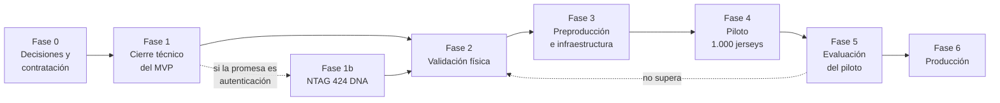

# Del piloto a producción

Camino desde el estado actual hasta una operación de producción, pasando por un
piloto de 1.000 jerseys.

> **Punto de partida, sin adornos.** El proveedor NFC por defecto es un simulador,
> ninguna verificación alcanza `VERIFIED`, la app Android nunca se ha compilado y no
> se ha ejecutado ninguna prueba física. Ver [limitaciones.md](limitaciones.md).

Este documento no contiene ninguna cifra de coste, plazo ni rendimiento. Lo que
contiene es **qué hay que cotizar, qué hay que medir y qué hay que decidir**, con los
criterios de salida de cada fase. Inventar números aquí sería el error más caro del
proyecto.

---

## 1. La decisión que atraviesa todas las fases

Hay una pregunta previa a cualquier plan:

> **¿Qué se le promete al aficionado?**

Las dos respuestas posibles llevan a proyectos distintos:

| Promesa | Chip necesario | Qué se puede decir |
|---|---|---|
| "Esta prenda tiene contenido digital y un registro de propiedad" | NTAG 213/215/216 basta | Identificación, certificado, titularidad, contenido, garantía |
| "Esta prenda se puede **autenticar**" | **NTAG 424 DNA es obligatorio** | Autenticación criptográfica verificable en servidor |

Con NTAG 21x el veredicto máximo es `IDENTIFIED_ONLY`, y su texto al aficionado ya
dice que la lectura "no incluyó una comprobación de seguridad" y que "sirve para
consultar información, no para confirmar autenticidad". Eso no es un defecto de
redacción que se pueda pulir: es la verdad del hardware.

**Si la promesa comercial es anticlonación, el piloto debe hacerse con NTAG 424
DNA.** Hacer el piloto con NTAG 21x y "mejorarlo después" significa que las 1.000
primeras prendas nunca podrán autenticarse, porque el chip no es reprogramable a una
familia distinta: habría que sustituir el emblema.

Esa decisión se toma en la fase 0 y condiciona todo lo demás.

---

## 2. Visión general de las fases

| Fase | Qué produce | Bloquea a |
|---|---|---|
| 0 | Decisiones tomadas y proveedores contratados | Todo |
| 1 | MVP funcional con hardware real | Fase 2 |
| 1b | Autenticación criptográfica, si se decide | Fase 2, si la promesa es autenticación |
| 2 | Receta de termosellado y resultados de ensayo | Fase 4 |
| 3 | Infraestructura y cumplimiento listos | Fase 4 |
| 4 | 1.000 jerseys en el mercado | Fase 5 |
| 5 | Decisión de escalar o corregir | Fase 6 |
| 6 | Operación sostenida | — |

---

## 3. Fase 0 — Decisiones y contratación

### 3.1 Decisiones que hay que tomar por escrito

| # | Decisión | Consecuencia de no tomarla |
|---|---|---|
| 1 | **Promesa comercial**: identificación o autenticación | Se construye lo que no se necesita |
| 2 | **Familia de chip** para el piloto | Si se elige NTAG 21x y luego se quiere autenticar, hay que sustituir emblemas |
| 3 | **Dominio definitivo** de la web del aficionado | La URL grabada en el chip **no se puede cambiar sin reprogramar**. Y `checkUriFits` rechaza la reserva si no cabe |
| 4 | **Estrategia de activación**: al salir de producción o al vender | Determina si una prenda robada del almacén verifica. Ver [integracion-tienda.md](integracion-tienda.md) |
| 5 | Si el piloto incluye **venta en tienda física** | Si la incluye, hace falta un camino de activación en mostrador que hoy no existe |
| 6 | Si se importa propiedad desde la compra o se deja el **reclamo** del aficionado | El reclamo ya está implementado y se apoya en tenencia física |
| 7 | **Custodio de claves**: KMS, HSM o SAM | Determina coste y complejidad. Ver [plan-gestion-claves.md](plan-gestion-claves.md) |
| 8 | **Alcance geográfico y de clubes** del piloto | Determina la cobertura de teléfonos a ensayar |
| 9 | Si se hace **bloqueo** de los chips NTAG 21x | Hoy no está implementado y es irreversible. Ver [protocolo-programacion.md](protocolo-programacion.md) sección 6 |
| 10 | Quién es el **responsable de protección de datos** del proyecto | Bloquea el registro ante la autoridad |

La decisión 3 merece insistencia: **la URL es permanente por chip.** Debe ser corta,
sobre un dominio que Marathon controle a largo plazo, y definitiva antes del primer
lote programado.

### 3.2 Contratación y credenciales

Lo que hay que conseguir antes de avanzar. Ninguno de estos elementos se resuelve
programando.

| Elemento | Para qué | Bloquea |
|---|---|---|
| Proveedor de emblemas con inlay NFC | Producto | Todo lo físico |
| **Hoja de datos del inlay, por escrito** | Tolerancia térmica, mecánica y de humedad | Fase 2 completa |
| Documentación oficial de NXP para NTAG 424 DNA | Comandos y gestión de claves | Fase 1b |
| Clave pública de originalidad de NXP | `READ_SIG` | Comprobación de originalidad |
| Proveedor de KMS, HSM o SAM | Custodia de claves y firma de certificados | `VERIFIED` y firma del certificado |
| Gestor de secretos en producción | Secretos de aplicación | Fase 3 |
| Alojamiento y base de datos gestionada | Infraestructura | Fase 3 |
| Proveedor de correo transaccional | Transferencias y avisos | Fase 4 |
| Acceso a la API de la tienda y su secreto de firma | Activación al vender | Fase 3 |
| Play Integrity API | Atestación del dispositivo de planta | Mejora de seguridad |
| Laboratorio textil | Ensayos con norma reconocida | Fase 2 |
| Teléfonos de ensayo | Ensayo 17 de [pruebas-fisicas.md](pruebas-fisicas.md) | Fase 2 |
| Asesoría legal en protección de datos | Cumplimiento LOPDP | Fase 3 |

### 3.3 Criterios de salida de la fase 0

- [ ] Las diez decisiones documentadas y firmadas por quien corresponda.
- [ ] Hoja de datos del inlay recibida por escrito.
- [ ] Dominio definitivo registrado, con TLS, y `FAN_WEB_PUBLIC_URL` fijada.
- [ ] Longitud de la URL validada con `checkUriFits` para el tipo de chip elegido.
- [ ] Proveedores de emblemas, alojamiento, KMS y laboratorio seleccionados.
- [ ] Responsable de protección de datos designado.
- [ ] Presupuesto aprobado con las partidas de la sección 10 cotizadas.

---

## 4. Fase 1 — Cierre técnico del MVP

Objetivo: que el sistema funcione de extremo a extremo con hardware real, sin
simulador, aunque el veredicto máximo siga siendo `IDENTIFIED_ONLY`.

### 4.1 Trabajo bloqueante

| # | Tarea | Por qué bloquea |
|---|---|---|
| 1 | **Compilar la app Android.** Instalar Android SDK y Gradle, añadir `gradle-wrapper.jar`, resolver dependencias | 59 archivos Kotlin nunca compilados. No se sabe si el código es válido |
| 2 | Ejecutar el flujo completo con `NFC_PROVIDER=ntag21x` y chips reales | Es lo único que demuestra que la programación funciona |
| 3 | Implementar el **planificador de tareas** y los trabajos de purga | La retención está declarada y no aplicada. Es un incumplimiento, no una mejora |
| 4 | Implementar el cálculo de `CampaignMetric` | Sin él, la analítica de patrocinadores devuelve vacío |
| 5 | Corregir la **granularidad de ámbito** de las rutas del panel | Hoy el panel solo es usable con asignación `GLOBAL` |
| 6 | Proteger `/me` y `/logout` sin exigir `catalog:read` | Un patrocinador no puede leer su perfil |
| 7 | Crear la pantalla `/patrocinador/campana/[campaignId]` | El enlace existe y devuelve 404 |
| 8 | Implementar las rutas de `support:write`, `privacy:write`, `fans:read` y `ownership:*` | `SUPPORT` no puede resolver nada |
| 9 | Implementar `content:write` y `catalog:write` | `CONTENT_AGENCY` no puede hacer aquello para lo que existe |
| 10 | Auditar `GET /admin/chips` | La consulta que revela UID completos no deja rastro |
| 11 | Revocar sesiones al desactivar usuario o dispositivo | La desactivación deja sesiones vivas hasta 4 o 12 h |
| 12 | Añadir `stationId` y referencia de receta a `PostPressCheck` | Sin ellos no se pueden correlacionar fallos de prensa |

### 4.2 Trabajo recomendado, no bloqueante

| Tarea | Beneficio |
|---|---|
| Atestación con Play Integrity | Convierte la lista de dispositivos en una comprobación real |
| MFA para roles administrativos | Hoy una contraseña comprometida da acceso completo |
| Observabilidad: métricas, trazas, alertas | Hoy un incidente se detecta porque alguien se queja |
| Identificador de correlación por petición | Diagnóstico de incidentes |
| Pantalla para marcar un lote | Hoy se hace por base de datos |
| Pruebas de carga sobre la ruta de verificación | El motor de riesgo consulta varias agregaciones por lectura |
| `packages/config` con la configuración compartida | Coherencia entre paquetes |
| `src/scripts/export-openapi.ts` | El script de `package.json` falla |

### 4.3 Criterios de salida de la fase 1

- [ ] La app Android compila y se instala en un teléfono físico.
- [ ] Un chip real se programa, se verifica y queda en `VERIFIED` (estado de chip) con
      `NFC_PROVIDER=ntag21x`.
- [ ] Ningún registro del flujo de prueba tiene `simulated: true`.
- [ ] Un intento de programar desde un teléfono no autorizado se rechaza y queda
      auditado.
- [ ] Los trabajos de purga se ejecutan periódicamente y se comprueba que borran.
- [ ] El panel es usable por los siete roles con sus ámbitos reales.
- [ ] `SUPPORT` puede resolver un caso y una solicitud de derechos de extremo a
      extremo.
- [ ] Un patrocinador de prueba ve su campaña y no ve nada más.
- [ ] La suite de pruebas pasa, incluidas las de autorización y las del motor de
      riesgo.

---

## 5. Fase 1b — NTAG 424 DNA

Solo si la promesa comercial es autenticación. Es la fase que convierte
"identificar" en "autenticar".

### 5.1 Cuándo pasar a NTAG 424 DNA

Los disparadores, en orden de contundencia:

| Disparador | Por qué obliga |
|---|---|
| **La promesa comercial dice "auténtico" o "anticlonación"** | Con NTAG 21x esa afirmación es falsa. No es un matiz: el techo del método lo impide |
| Aparecen copias en el mercado | El motor de riesgo detecta patrones, no clones. Las señales blandas están calibradas para que ninguna aislada alcance el umbral, precisamente porque no son fiables |
| El producto sube de precio o es edición limitada | El incentivo del falsificador crece con el valor de la pieza |
| Un patrocinador o un club exige garantía verificable | Una garantía sin criptografía no es verificable |
| Se detecta un UID duplicado en un lote | Indica etiquetas con UID escribible en la cadena de suministro. Es la señal más grave |

Y el argumento inverso, igual de válido: **si la promesa es contenido digital y
registro de propiedad, NTAG 21x es suficiente** y pasar a 424 añade coste sin añadir
valor.

### 5.2 Por qué NTAG 424 DNA y no otra cosa

| Propiedad | Consecuencia |
|---|---|
| El chip ejecuta una operación criptográfica sobre un mensaje que cambia en cada lectura | Copiar una lectura no sirve para la siguiente |
| El mensaje autenticado se valida **en el servidor** | El teléfono no decide nada; es un túnel |
| Las claves son diversificadas por chip | Comprometer un chip no compromete el lote |
| Las claves no salen del custodio | La aplicación nunca las ve |
| El contador de lecturas sostiene la detección de repetición | `lastAcceptedCounter` solo avanza en una lectura aceptada |

El contrato ya está definido en `packages/nfc-contracts`: `personalizeSecureTag` y
`readVerificationPayload` son los dos puntos de integración, y el adaptador actual
lanza `NOT_IMPLEMENTED` en todos sus métodos a propósito.

### 5.3 Lo que hace falta

Todo está detallado en [guia-ntag424-dna.md](guia-ntag424-dna.md). Resumen:

1. Documentación oficial de NXP. **No se escribe ni un comando sin ella.**
2. Chips físicos, incluido un lote sacrificable.
3. Custodio de claves operativo, con la ceremonia de generación ejecutada. Ver
   [plan-gestion-claves.md](plan-gestion-claves.md).
4. Implementar el adaptador siguiendo las fases A a F de la guía: preparación,
   lectura sin escribir, verificación antes que personalización, personalización,
   bloqueo y cierre, puesta en marcha.
5. Cambiar `canProduceCryptographicProof` a `true` **solo** cuando los criterios de
   aceptación de la guía se cumplan.

### 5.4 Criterios de salida de la fase 1b

Los de la sección 6 de [guia-ntag424-dna.md](guia-ntag424-dna.md), más:

- [ ] Una lectura real produce `VERIFIED` con evidencia criptográfica validada en
      servidor.
- [ ] Una lectura repetida del mismo mensaje se rechaza por el control
      anti-repetición.
- [ ] Ninguna clave aparece en el teléfono, en la base de datos ni en un registro.
- [ ] La ceremonia de generación de claves está ejecutada y documentada.
- [ ] El certificado digital se firma con clave custodiada: `signature` deja de ser
      `null`.

---

## 6. Fase 2 — Validación física

Objetivo: la receta de termosellado y los resultados de ensayo. Es la fase que no se
puede acelerar porque depende del calendario del laboratorio y de los ciclos de
lavado.

### 6.1 Trabajo

Ejecutar el protocolo de [pruebas-fisicas.md](pruebas-fisicas.md). Los ensayos
marcados como bloqueantes en su tabla resumen: 1 a 7, 9, 12, 13, 15 a 20.

Orden obligado por dependencias:

1. Ensayo 1 (lectura previa) y ensayo 20 (inspección de lote): sin lote validado no
   se ensaya nada.
2. Ensayos 2, 3 y 4 (temperatura, presión, tiempo): producen la receta.
3. Ensayo 5 (lectura posterior): valida la receta.
4. Ensayos 16 y 17 (distancia, teléfonos): definen la instrucción al aficionado.
5. Ensayos 6, 7, 9, 15 (lavado, sudor, flexión, mojado): durabilidad de uso.
6. Ensayos 12, 13, 18, 19 (tracción, delaminación, extracción, trasplante): resistencia
   y seguridad del montaje.
7. Ensayos 8, 10, 11, 14 (humedad, torsión, abrasión, envejecimiento): no bloqueantes,
   en paralelo.

### 6.2 Criterios de salida de la fase 2

- [ ] Receta de termosellado documentada con tolerancias y con margen por ambos
      lados de la ventana.
- [ ] Tiempo de enfriamiento antes de la lectura posterior establecido.
- [ ] Número de ciclos de lavado garantizados, medido y no estimado.
- [ ] Instrucción de lectura para el aficionado redactada a partir del ensayo 16.
- [ ] Tabla de compatibilidad de teléfonos, con fecha y versión de sistema
      operativo.
- [ ] Cobertura de teléfonos por encima del umbral acordado con negocio.
- [ ] Resultado del ensayo de extracción y trasplante evaluado, y decisión tomada si
      aparece un hallazgo crítico.
- [ ] Umbrales de aceptación y tasas de rechazo acordados con calidad.
- [ ] Formulario de resultados completo y firmado.
- [ ] Ningún registro de ensayo con `simulated: true`.

Si un ensayo bloqueante no se supera, **no se avanza**: se corrige el montaje, la
receta o el material y se repite.

---

## 7. Fase 3 — Preproducción e infraestructura

Objetivo: que exista un entorno de producción operable y que el cumplimiento esté
resuelto antes de tratar datos de personas reales.

### 7.1 Infraestructura

| Elemento | Requisito mínimo para el piloto | Nota |
|---|---|---|
| PostgreSQL | Base gestionada, con copias de seguridad automáticas y **restauración probada** | Una copia no probada no es una copia |
| API | Al menos dos instancias por disponibilidad | **Exige Redis antes**, ver 7.2 |
| Proxy inverso o balanceador | Termina TLS y aporta la IP del cliente | `trustProxy: true` **solo** es correcto detrás de un proxy propio |
| Web del aficionado | Alojamiento con CDN | La cabecera de país del CDN alimenta la señal geográfica |
| Panel administrativo | Alojamiento separado, acceso restringido | Está en la lista blanca de CORS |
| Gestor de secretos | Obligatorio | Los secretos no salen de un archivo versionado |
| Custodio de claves | Según la decisión de la fase 0 | — |
| Correo transaccional | Obligatorio | Mailpit es solo desarrollo |
| Registros y métricas | Recolector con retención corta para los logs | Ver [politica-logs.md](politica-logs.md) |
| Alertas | Canal con guardia asignada | Hoy no existe |

### 7.2 Redis, y por qué es un prerrequisito

El MVP no despliega Redis: la limitación de peticiones es **en memoria del proceso**.
Con `N` instancias, el límite efectivo es `N × límite`.

> **No se puede desplegar más de una instancia de API sin un almacén compartido de
> límite de peticiones.** No es una mejora futura: es un prerrequisito del escalado
> horizontal.

El cambio es de configuración, no de arquitectura: `@fastify/rate-limit` acepta un
`store` alternativo. Y Redis resuelve además el bloqueo distribuido, la caché de
contenido y la cola de trabajos asíncronos, que hoy no existe.

Alternativa legítima para el piloto: **una sola instancia de API**, aceptando la
indisponibilidad durante un despliegue. Con 1.000 jerseys puede ser razonable, y hay
que decidirlo explícitamente, no por omisión.

### 7.3 Configuración de producción

| Variable | Requisito |
|---|---|
| `NODE_ENV` | `production`. Activa `trustProxy` y HSTS |
| `NFC_PROVIDER` | `ntag21x` o `ntag424dna`. **Nunca `mock`**: el arranque falla |
| `SESSION_SECRET`, `TOKEN_HASH_PEPPER`, `ANALYTICS_IP_SALT` | Generados con entropía real. Si conservan el prefijo `dev-only-insecure`, el arranque falla |
| `FAN_WEB_PUBLIC_URL` | El dominio definitivo. **No se cambia después** |
| `KMS_PROVIDER` | El custodio real |
| `RATE_LIMIT_*` | Calibrados con el tráfico esperado |
| `VERIFICATION_EVENT_RETENTION_DAYS` | Coherente con `RETENTION_DAYS` |

Procedimientos que deben existir por escrito y **probados**, no solo redactados:

- Restauración de copia de seguridad.
- Rotación de `ANALYTICS_IP_SALT`.
- Rotación de `TOKEN_HASH_PEPPER`. Es la más delicada: invalida todos los hashes de
  token existentes.
- Respuesta ante pérdida de `TOKEN_HASH_PEPPER`. Sin la pimienta, **ningún chip
  verifica**.
- Respuesta ante sospecha de compromiso de claves. Ver
  [plan-gestion-claves.md](plan-gestion-claves.md) sección 7.
- Notificación de brechas, con plazos y responsable.

### 7.4 Cumplimiento

Ninguno de estos puntos lo resuelve el software. Todos están detallados en
[privacidad-lopdp.md](privacidad-lopdp.md) sección 11.

| # | Obligación | Estado |
|---|---|---|
| 1 | Registro de la base de datos ante la autoridad de protección de datos | Pendiente |
| 2 | Evaluación de impacto | Pendiente |
| 3 | Designación de delegado de protección de datos, si procede | Pendiente |
| 4 | Política de privacidad publicada y versionada, coherente con `Consent.policyVersion` | Pendiente |
| 5 | Contratos con encargados: alojamiento, base de datos, correo, observabilidad | Pendiente |
| 6 | Acuerdo de corresponsabilidad con cada club | Pendiente |
| 7 | Ponderación escrita del interés legítimo para la verificación y la detección de abuso | Pendiente |
| 8 | Procedimiento de verificación de identidad para solicitudes de derechos | Pendiente |
| 9 | **Cláusulas y flujo para menores de edad** | Pendiente. Un jersey de club tiene demanda infantil evidente y el sistema no contempla verificación de edad ni consentimiento de representante |
| 10 | Ejecución efectiva de la retención | Depende de la tarea 3 de la fase 1 |
| 11 | Registro de actividades de tratamiento | Insumo en [privacidad-lopdp.md](privacidad-lopdp.md) sección 10 |
| 12 | Determinación de transferencias internacionales | Depende del proveedor de alojamiento. **No se rellena por suposición** |

El punto 9 es un bloqueante real: abrir el registro de cuentas sin resolverlo es
tratar datos de menores sin base.

### 7.5 Criterios de salida de la fase 3

- [ ] Entorno de producción desplegado y accesible por el dominio definitivo.
- [ ] Copia de seguridad ejecutada y **restauración probada** en un entorno aparte.
- [ ] Secretos generados en el gestor de secretos, ninguno con prefijo de desarrollo.
- [ ] Redis desplegado, o decisión explícita y documentada de operar con una sola
      instancia.
- [ ] `trustProxy` verificado: una cabecera `X-Forwarded-For` falsificada desde
      fuera no altera la IP registrada.
- [ ] Los doce puntos de cumplimiento resueltos o con plan y responsable asignados.
- [ ] Política de privacidad publicada, con su versión registrada.
- [ ] Alertas configuradas con guardia asignada.
- [ ] Ensayo de un despliegue completo y de su reversión.
- [ ] Integración con la tienda funcionando en un entorno de pruebas, con sus
      criterios de aceptación de [integracion-tienda.md](integracion-tienda.md).

---

## 8. Fase 4 — Piloto de 1.000 jerseys

Objetivo: producir, vender y operar 1.000 unidades reales, midiendo todo.

### 8.1 Preparación de la línea

| # | Tarea |
|---|---|
| 1 | Puesto de programación montado según [protocolo-programacion.md](protocolo-programacion.md) sección 2 |
| 2 | Teléfonos dados de alta en `AuthorizedDevice`, con `deviceId` tratado como dato interno |
| 3 | Operarios formados, con los criterios de cuarentena y la regla "ante la duda, cuarentena" |
| 4 | Estación de prensa con la receta cargada y la prensa calibrada |
| 5 | Registro de lote preparado |
| 6 | Supervisor identificado para las escaladas |
| 7 | Guion de soporte escrito, partiendo de que el veredicto normal es `IDENTIFIED_ONLY` |
| 8 | Muestreo de arranque ejecutado: unidades de prueba rotuladas y **fuera del flujo comercial** |

### 8.2 Escalonado del piloto

No se programan 1.000 unidades el primer día.

| Tramo | Unidades | Para qué | Puerta de paso |
|---|---|---|---|
| A | 25 | Validar el puesto, la receta y la app en condiciones reales | Tasa de primer intento y tasa de cuarentena dentro de lo acordado |
| B | 100 | Validar el ritmo y la estabilidad del turno | Sin incidencias de trazabilidad; conteo físico cuadrado |
| C | 200 | Primeras ventas reales y primeras lecturas de aficionados | Ninguna reclamación por fallo de lectura; integración con la tienda sin pérdida de eventos |
| D | 675 | Completar el piloto | — |

Entre tramos se revisan los indicadores y se decide seguir o corregir. Un tramo que
no pasa su puerta **no se compensa produciendo más rápido el siguiente**.

### 8.3 Qué medir durante el piloto

**Producción:**

| Indicador | Fuente |
|---|---|
| Tasa de primer intento | Chips con una sola escritura / total |
| Reintentos por chip | `PersonalizationJob.attempts` |
| Tasa de cuarentena | Unidades en cuarentena / total |
| Fallos por código de error | Agrupación de `lastError` |
| Tasa de rechazo posterior al termosellado | `PostPressCheck.passed` |
| Correlación de fallos con receta, posición en la placa y lote | `PostPressCheck` + registro de lote |
| Trabajos `FAILED` sin resolver al cierre de turno | `GET /production/me/history` |

**Campo:**

| Indicador | Fuente |
|---|---|
| Lecturas por unidad y su distribución | `VerificationEvent`, `JerseyUnit.interactionCount` |
| Distribución de niveles de confianza | `VerificationEvent.trustLevel` |
| Proporción de `UNVERIFIABLE` | Es el indicador de fracaso de lectura en campo |
| Proporción de lecturas por QR frente a NFC | Mide la cobertura real de teléfonos |
| Alertas de riesgo abiertas y su tasa de falsos positivos tras revisión | `RiskAlert` |
| Tasa de reclamo de titularidad | `Ownership` con `acquiredVia = CLAIM` |
| Casos de soporte por causa | `SupportCase` |
| Solicitudes de derechos y cumplimiento del plazo de 15 días | `PrivacyRequest.dueAt` |

**Sistema:**

| Indicador | Fuente |
|---|---|
| Latencia de la ruta de verificación | Observabilidad |
| Coste de la consulta de historial del motor de riesgo | Observabilidad |
| Eventos de límite de peticiones alcanzado | Registros |
| Crecimiento de `VerificationEvent` | Base de datos |
| Eventos de la tienda perdidos o reintentados | Cola de fallidos |

El indicador más revelador es la **proporción de `UNVERIFIABLE`**: mide cuántas veces
una persona real acercó el teléfono y no consiguió nada. Es lo que decide si el
producto funciona, con independencia de lo que digan los ensayos de laboratorio.

### 8.4 Criterios de salida de la fase 4

- [ ] 1.000 unidades producidas, con su trazabilidad completa.
- [ ] Conteo físico cuadrado con el del sistema en cada cierre de turno, sin
      discrepancias sin resolver.
- [ ] Toda unidad en cuarentena con motivo registrado y decisión tomada.
- [ ] Tasas de cuarentena y de rechazo dentro de lo acordado con calidad.
- [ ] Proporción de `UNVERIFIABLE` por debajo del umbral acordado.
- [ ] Ninguna incidencia de seguridad sin resolver.
- [ ] Ninguna solicitud de derechos fuera del plazo interno de 15 días.
- [ ] La integración con la tienda sin pérdida de eventos detectada.
- [ ] Registro de auditoría revisado por alguien distinto de quien operó.

---

## 9. Fase 5 — Evaluación, y fase 6 — Producción

### 9.1 Preguntas que el piloto debe responder

| Pregunta | Se responde con |
|---|---|
| ¿La lectura funciona en manos de gente real? | Proporción de `UNVERIFIABLE` y casos de soporte |
| ¿El montaje sobrevive al uso? | Reclamaciones y devoluciones por fallo de lectura |
| ¿La línea sostiene el ritmo? | Tasa de primer intento y de cuarentena |
| ¿El motor de riesgo es útil o solo ruidoso? | Tasa de falsos positivos tras revisión humana |
| ¿Los aficionados usan lo que se construyó? | Tasa de reclamo, vistas de contenido, canjes |
| ¿Hay señales de copia? | UID duplicados, patrones de lectura anómalos |
| ¿El coste por unidad es sostenible? | Partidas de la sección 10, medidas |
| ¿Hace falta NTAG 424 DNA? | Los disparadores de 5.1, evaluados con datos |

### 9.2 Recalibración obligatoria del motor de riesgo

Los pesos y umbrales del motor están calibrados **sin datos reales**: se eligieron
para que ninguna señal blanda aislada alcance el umbral. El piloto es la primera
oportunidad de medirlos.

Trabajo de la fase 5: revisar cada alerta abierta con decisión humana, clasificarla
como confirmada o descartada, y ajustar los pesos con esa evidencia. Un motor que
genera alertas que nadie confirma acaba ignorado, y entonces no protege de nada.

### 9.3 Qué cambia al escalar

| Aspecto | Piloto (1.000) | Producción |
|---|---|---|
| Instancias de API | Una puede bastar | Varias, y por tanto **Redis obligatorio** |
| Base de datos | Instancia única gestionada | Réplica de lectura y plan de crecimiento para `VerificationEvent` |
| Puestos de programación | Uno | Varios, con su propia `ProgrammingStation` y sus indicadores separados |
| Purga | Trabajos periódicos simples | Purga por lotes con ventana de mantenimiento |
| Analítica | Cálculo nocturno | Agregación incremental |
| Exportaciones | 5.000 filas con aviso de truncado | Generación asíncrona con descarga diferida |
| Soporte | Una persona | Turnos, guion formalizado, escalada definida |
| Claves | KMS | Reevaluar HSM o SAM según el criterio de [plan-gestion-claves.md](plan-gestion-claves.md) sección 3.1 |
| Copias de seguridad | Automáticas, restauración probada una vez | Restauración probada de forma periódica |

### 9.4 Criterios de salida de la fase 5

- [ ] Informe del piloto con las ocho preguntas de 9.1 respondidas con datos.
- [ ] Motor de riesgo recalibrado con evidencia real.
- [ ] Decisión documentada sobre NTAG 424 DNA.
- [ ] Coste real por unidad medido y comparado con el presupuesto.
- [ ] Plan de escalado con las partidas de 9.3 presupuestadas.
- [ ] Lista de defectos del piloto, con corrección asignada.

### 9.5 Cuándo **no** pasar a producción

Situaciones en las que la respuesta correcta es volver a una fase anterior:

- La proporción de `UNVERIFIABLE` está por encima del umbral: el producto no
  funciona en campo, aunque los ensayos pasaran.
- Aparecieron UID duplicados: hay un problema de cadena de suministro que escalar
  multiplicaría.
- El ensayo de extracción reveló que el emblema se saca con chip funcional y sin
  daño evidente: escalar es distribuir el vector de ataque.
- Hay solicitudes de derechos fuera de plazo: escalar multiplica un incumplimiento.
- La retención sigue sin aplicarse: escalar multiplica los datos que no se purgan.
- La promesa comercial dice "auténtico" y el sistema sigue dando
  `IDENTIFIED_ONLY`: escalar es escalar una afirmación falsa.

---

## 10. Partidas de coste a cotizar

**Ninguna cifra en esta sección, a propósito.** Lo que hay es la lista de lo que hay
que pedir cotizado, con la unidad en la que conviene pedirlo. Un número inventado
aquí se convertiría en un compromiso.

### 10.1 Coste por unidad

| Partida | Unidad de cotización | Notas |
|---|---|---|
| Inlay NFC NTAG 213/215/216 | Por millar, por familia | El precio varía con la memoria |
| Inlay NFC NTAG 424 DNA | Por millar | **Cotizar aparte y comparar** con la familia 21x: es la cifra que decide la fase 1b |
| Emblema con inlay integrado | Por millar, por diseño | Incluye troquelado y acabado |
| Adhesivo termosellable | Por unidad o por metro | Según referencia validada en la fase 2 |
| Merma esperada de producción | Porcentaje sobre el lote | **Se estima con los datos de la fase 2**, no antes |
| Coste de mano de obra por unidad programada | Segundos por unidad × coste hora | Se mide en el tramo A del piloto |
| Coste del ciclo de prensa por unidad | Energía y ocupación de máquina | — |

### 10.2 Coste no recurrente

| Partida | Unidad de cotización |
|---|---|
| Desarrollo pendiente de la fase 1 | Días-persona por tarea de 4.1 |
| Integración de NTAG 424 DNA | Días-persona, más chips sacrificables |
| Teléfonos autorizados de planta | Por unidad, con recambio |
| Teléfonos de ensayo del ensayo 17 | Por modelo; se puede reducir con préstamos |
| Instrumentación de ensayo: guía graduada, útiles de flexión y torsión | Por útil |
| Ensayos de laboratorio textil | **Por ensayo y por número de muestras.** Los ensayos de lavado y envejecimiento son los más caros por duración |
| Prensa de termosellado, si hace falta | Por máquina |
| Ceremonia de generación de claves | Días-persona de los roles implicados |
| Asesoría legal y evaluación de impacto | Por alcance |
| Registro ante la autoridad de protección de datos | Según tasas vigentes |
| Diseño y producción del QR de respaldo | Por diseño |
| Formación de operarios y de soporte | Por sesión |

### 10.3 Coste recurrente

| Partida | Unidad de cotización |
|---|---|
| Alojamiento de la API | Por instancia y mes |
| Base de datos gestionada | Por tamaño y mes, **con proyección de crecimiento de `VerificationEvent`** |
| Redis | Por instancia y mes |
| Alojamiento de las dos webs y CDN | Por tráfico |
| Gestor de secretos | Por secreto y mes |
| KMS | **Por clave y por operación.** Con claves diversificadas por chip, el número de operaciones crece con las lecturas: hay que proyectarlo |
| HSM o SAM, si se elige | Por dispositivo o por mes |
| Correo transaccional | Por millar de envíos |
| Observabilidad y retención de registros | Por volumen ingerido y mes |
| Copias de seguridad y almacenamiento | Por tamaño y mes |
| Dominio y certificados | Anual |
| Play Integrity | Según modelo de precios de Google |
| Soporte y operación | Por persona y mes |
| Guardia para alertas | Por turno |

### 10.4 Costes que se olvidan y conviene cotizar

| Partida | Por qué se olvida |
|---|---|
| Chips y prendas destruidos en los ensayos | Los ensayos 12, 13, 18 y 19 son destructivos por definición |
| Unidades de arranque de turno, fuera del flujo comercial | Se rotulan como prueba y no se venden |
| Reprocesado de unidades en cuarentena | Tiempo de diagnóstico y decisión, no solo material |
| Atención de reclamaciones por fallo de lectura | Es el coste que la fase 2 existe para reducir |
| Sustitución de emblemas si un lote se marca | Una decisión de calidad puede afectar a producto vendido |
| Reprogramación si el dominio cambia | La URL es permanente por chip. Este coste es la razón de la decisión 3 de la fase 0 |
| Tiempo de operación: purgas, rotaciones, revisión de auditoría | No es desarrollo, es operación continua |
| Rotación de `ANALYTICS_IP_SALT` cada 30 días | Procedimiento recurrente |

La penúltima merece un recordatorio: **si el dominio de la web del aficionado cambia
después de programar, hay que reprogramar cada chip.** Es una partida potencialmente
mayor que todo el desarrollo.

---

## 11. Resumen de bloqueantes por fase

| Fase | Bloqueante principal |
|---|---|
| 0 | Hoja de datos del inlay y dominio definitivo |
| 1 | La app Android no compila: no hay Android SDK ni Gradle |
| 1b | Documentación oficial de NXP y custodio de claves operativo |
| 2 | Laboratorio textil y emblemas reales |
| 3 | Cumplimiento LOPDP, incluido el flujo para menores, y Redis si hay más de una instancia |
| 4 | Que las fases 2 y 3 estén realmente cerradas |
| 5 | Datos del piloto, no impresiones |
| 6 | Que el piloto haya respondido las ocho preguntas de 9.1 |

---

## 12. Documentos relacionados

- [limitaciones.md](limitaciones.md)
- [arquitectura.md](arquitectura.md)
- [guia-ntag424-dna.md](guia-ntag424-dna.md)
- [plan-gestion-claves.md](plan-gestion-claves.md)
- [modelo-amenazas.md](modelo-amenazas.md)
- [pruebas-fisicas.md](pruebas-fisicas.md)
- [protocolo-programacion.md](protocolo-programacion.md)
- [protocolo-termosellado.md](protocolo-termosellado.md)
- [integracion-tienda.md](integracion-tienda.md)
- [privacidad-lopdp.md](privacidad-lopdp.md)
- [politica-logs.md](politica-logs.md)
- [guia-panel.md](guia-panel.md)
