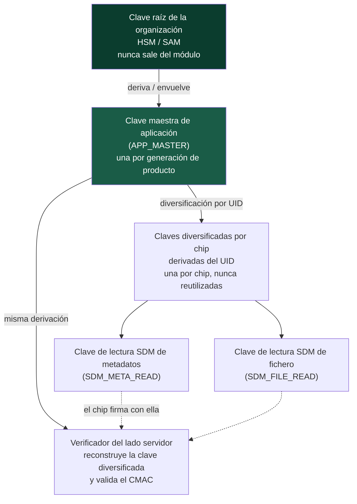

# Plan de gestión de claves

---

## 0. Estado actual, sin ambigüedad

> **Hoy no existe ninguna custodia real de claves.**
>
> `KMS_PROVIDER=null-kms` es el único valor admitido por la validación de
> configuración (`apps/api/src/config.ts`). El proveedor `null-kms` **no custodia
> claves**: únicamente registra referencias.
>
> No hay ninguna clave maestra NFC generada, ni almacenada, ni usada. El adaptador
> NTAG 424 DNA lanza `NOT_IMPLEMENTED` en todas las operaciones que necesitarían
> material criptográfico.

Este documento describe, por tanto, **un plan**. La sección 11 separa
explícitamente lo implementado de lo previsto.

### Lo que sí es real hoy

| Elemento | Estado |
|---|---|
| Tabla `NfcKeyReference` con `{ keyRole, reference, custodian, version }` | Existe en el esquema |
| Tipo `KeyReference` opaco en el contrato de proveedor | Existe |
| Contrato `SecureElementPersonalizationService` (el servidor construye los APDU) | Existe como interfaz, sin implementación |
| Barrera de arranque contra secretos de ejemplo en producción | Implementada |
| Saneador que redacta material sensible del registro de auditoría | Implementado |
| Secretos de aplicación (`SESSION_SECRET`, `TOKEN_HASH_PEPPER`, `ANALYTICS_IP_SALT`) | Existen, en variables de entorno |

---

## 1. Regla inviolable

Declarada en tres lugares del código, con las mismas palabras:

- `packages/nfc-contracts/src/provider.ts`
- `apps/api/prisma/schema.prisma` (cabecera)
- `.env.example`

> Ninguna implementación recibe, almacena ni devuelve claves maestras. Cuando una
> operación necesita material criptográfico, recibe una `KeyReference` opaca (un
> identificador en el KMS/HSM/SAM) y la operación criptográfica se ejecuta en el
> servicio que custodia la clave.

Corolarios operativos:

1. **Ninguna clave vive en la app móvil.** Ni en el código, ni en recursos, ni en
   el Keystore, ni en memoria. El teléfono recibe APDU ya construidos y cifrados
   y los retransmite.
2. **Ninguna clave vive en la base de datos de la aplicación.** `NfcKeyReference`
   guarda un puntero, no un valor.
3. **Ninguna clave aparece en un registro.** El saneador de `lib/audit.ts` redacta
   `masterkey`, `keyvalue`, `cmac`, `sdmmac`, `privatekey`, `secret`, `pepper`,
   `salt` y otros patrones.
4. **Ninguna clave se versiona en el repositorio.** Incluye la clave pública de
   originalidad de NXP, que es pública pero se obtiene bajo registro del
   fabricante y se suministra por configuración.

---

## 2. Jerarquía de claves prevista para NTAG 424 DNA

> **Advertencia.** La estructura de claves y de ficheros del NTAG 424 DNA está
> definida en la hoja de datos del producto y en la nota de aplicación de NXP,
> **que se distribuyen bajo registro y que este proyecto no tiene**. La jerarquía
> siguiente es el diseño previsto y **debe validarse contra la documentación
> oficial y contra hardware real antes de ejecutarse**. No se describen aquí
> comandos, números de clave concretos ni estructuras de fichero, porque no se
> tienen con certeza.



### 2.1 Niveles

| Nivel | Nombre | `keyRole` en `NfcKeyReference` | Cuántas | Dónde vive | Quién la usa |
|---|---|---|---|---|---|
| 0 | Clave raíz de organización | — (no se referencia por chip) | 1 | HSM/SAM, nunca en claro fuera del módulo | Solo el proceso de derivación de claves de aplicación |
| 1 | Clave maestra de aplicación | `APP_MASTER` | 1 por generación de producto | KMS (piloto) / HSM (producción) | El servicio de personalización del servidor y el verificador |
| 2 | Clave diversificada por chip | (derivada, no almacenada) | 1 por chip | **No se almacena.** Se recalcula a demanda a partir de la maestra y el UID | Personalización y verificación, ambas en servidor |
| 3 | Clave de lectura SDM de metadatos | `SDM_META_READ` | 1 por chip (derivada) | No se almacena | El chip la usa para producir el mensaje; el servidor para validarlo |
| 3 | Clave de lectura SDM de fichero | `SDM_FILE_READ` | 1 por chip (derivada) | No se almacena | Ídem |

### 2.2 Por qué claves diversificadas por chip

Si todos los chips compartieran la misma clave, extraerla de **un solo chip**
comprometería el lote completo y no habría forma de recuperarse sin reprogramar
todo el inventario.

Con diversificación:

- Cada chip lleva una clave distinta, derivada de la maestra y de un dato único
  del chip (su UID).
- Comprometer un chip compromete un chip.
- El servidor no necesita almacenar N claves: recalcula la del chip concreto a
  partir de la maestra custodiada y del UID presentado.
- La rotación de la clave maestra cambia todas las claves derivadas de golpe
  (con el coste que se detalla en la sección 5).

---

## 3. Custodios por nivel de seguridad

| Fase | Custodio | Qué garantiza | Qué no garantiza |
|---|---|---|---|
| Desarrollo (hoy) | `null-kms` | **Nada.** Solo registra referencias | Todo |
| Piloto | **KMS gestionado** (AWS KMS, GCP Cloud KMS o equivalente) | La clave no sale del servicio; las operaciones se ejecutan dentro; registro de uso; control de acceso por IAM | Protección contra un administrador de la nube; no hay módulo físico dedicado |
| Producción | **HSM** (nube o dedicado) para la clave maestra, **SAM** en la estación de programación si se necesita rendimiento en planta | Módulo certificado; la clave no existe en claro fuera del hardware; resistencia a extracción física | Nada protege contra el uso legítimo indebido: hace falta control de acceso y auditoría |

### 3.1 Criterio para pasar de KMS a HSM/SAM

Se pasa a HSM/SAM cuando se cumple **cualquiera** de estas condiciones:

1. El volumen supera la capacidad razonable de latencia del KMS para la línea de
   producción (una llamada al KMS por chip, con la línea en marcha).
2. Se requiere certificación formal por un tercero (auditoría, contrato con un
   cliente, requisito de un licenciante deportivo).
3. La producción pasa a un tercero (maquila) y las claves deben poder usarse sin
   entregar credenciales de nube.
4. El valor del inventario expuesto a un compromiso de clave supera el coste del
   HSM.

El SAM (Secure Access Module) resuelve un problema distinto del HSM: pone la
capacidad criptográfica **en la estación**, de modo que la línea no dependa de la
red. Si se adopta, la estación deja de ser un túnel puro y pasa a ser un punto de
confianza, lo que exige control físico del módulo.

---

## 4. Qué se almacena en `NfcKeyReference` y qué no

```prisma
model NfcKeyReference {
  id        String   @id @default(uuid())
  chipId    String
  keyRole   String   // APP_MASTER, SDM_META_READ, SDM_FILE_READ, ...
  reference String   // ARN de KMS, slot de HSM, índice de SAM
  custodian String   @default("none")  // kms | hsm | sam | none
  version   Int      @default(1)
  createdAt DateTime @default(now())
  rotatedAt DateTime?
  @@unique([chipId, keyRole, version])
}
```

### 4.1 Se almacena

| Campo | Ejemplo | Por qué es seguro |
|---|---|---|
| `keyRole` | `SDM_META_READ` | Es un nombre de rol, no un secreto |
| `reference` | `arn:aws:kms:us-east-1:...:key/abc-123` | Es un puntero. Sin credenciales de IAM no sirve para nada |
| `custodian` | `kms` | Metadato operativo |
| `version` | `2` | Permite saber qué generación de clave se usó en cada chip |
| `rotatedAt` | fecha | Trazabilidad de la rotación |

### 4.2 No se almacena jamás

- El valor de una clave maestra, en claro o cifrado.
- El valor de una clave diversificada.
- Cualquier material derivado del que se pueda reconstruir una clave.
- Un CMAC o SDMMAC de referencia.
- Una clave de sesión de una autenticación con el chip.
- El mensaje autenticado completo: **solo su huella**
  (`messageFingerprint`, calculada con `fingerprintMessage()` en
  `lib/request-context.ts`). Guardar el mensaje entero permitiría reutilizarlo si
  la base se filtrara.

### 4.3 Comprobación práctica

Si alguien obtiene un volcado completo de la base de datos de la aplicación, con
él **no puede**:

- Personalizar un chip nuevo.
- Producir un mensaje autenticado válido.
- Validar un mensaje autenticado.
- Reconstruir la clave de ningún chip.

Lo que **sí** puede hacer: enumerar qué chips existen, qué referencias de clave
tienen y en qué versión. Esa información es operativa y no criptográfica, pero es
inteligencia útil para un atacante y justifica que `chips:read` sea un permiso
sensible.

---

## 5. Rotación

### 5.1 Claves maestras NFC

| Aspecto | Política prevista |
|---|---|
| Periodicidad | Por **generación de producto**, no por calendario. Cada temporada o cada nueva familia de jersey usa una versión de clave nueva |
| Rotación forzada | Ante sospecha de compromiso (sección 7) |
| Compatibilidad | **Un chip ya personalizado no se puede repersonalizar en campo.** El verificador debe admitir varias versiones simultáneas y elegir según la `version` registrada en `NfcKeyReference` para ese chip |
| Coste de la rotación | Solo afecta a chips **nuevos**. Los existentes siguen verificándose con su versión |
| Retirada de una versión | Solo cuando no queda inventario activo con esa versión, o cuando se decide revocar ese inventario |

Esto es lo que justifica que `version` esté en la clave única
`(chipId, keyRole, version)` y no solo en la tabla: el histórico de versiones por
chip debe ser consultable.

### 5.2 Secretos de aplicación

| Secreto | Periodicidad | Consecuencia de rotar |
|---|---|---|
| `SESSION_SECRET` | Trimestral, o ante incidente | Todas las sesiones activas se invalidan. Aceptable |
| `ANALYTICS_IP_SALT` | **Cada 30 días** (declarado en `.env.example`) | Los seudónimos de IP y dispositivo cambian. Es el comportamiento **deseado**: impide correlacionar a una persona a lo largo del tiempo. Efecto secundario: el motor de riesgo deja de reconocer dispositivos anteriores a la rotación |
| `TOKEN_HASH_PEPPER` | **Ver advertencia** | — |

> **Advertencia sobre `TOKEN_HASH_PEPPER`.** Esta pimienta se usa para hashear
> `tagToken`, `qrToken`, `transferToken` y los tokens de sesión
> (`identifiers.ts` `hashToken()`). **Rotarla invalida todos los hashes
> existentes**, lo que significa que ningún chip ya programado volvería a
> resolverse.
>
> Hoy **no hay procedimiento de rotación implementado**. El procedimiento
> necesario, antes de que haya inventario en campo:
>
> 1. Introducir una columna de versión de pimienta, o una segunda columna de hash.
> 2. Durante la transición, calcular el hash con la pimienta nueva y, si no
>    coincide, reintentar con la antigua.
> 3. Rehashear de forma progresiva cada token en su primera resolución exitosa.
> 4. Retirar la pimienta antigua cuando la proporción de resoluciones con ella caiga
>    por debajo de un umbral y se cumpla un plazo.
>
> Sin este mecanismo, la pimienta es efectivamente **no rotable**, y eso debe
> decidirse conscientemente antes del piloto.

---

## 6. Ceremonia de generación de claves

Procedimiento previsto para la generación de la clave maestra de aplicación. **No
se ha ejecutado.**

### 6.1 Requisitos previos

| Requisito | Detalle |
|---|---|
| Custodio operativo | KMS o HSM aprovisionado, con control de acceso configurado |
| Personas | Mínimo tres, con roles distintos (sección 8) |
| Sala | Sin dispositivos personales, sin red no controlada |
| Acta | Formato preimpreso, con espacio para firmas |
| Testigo | Una persona ajena al equipo técnico |

### 6.2 Secuencia

1. **Apertura.** Se registra fecha, hora, personas presentes y propósito. Se
   declara la generación de producto a la que la clave servirá.
2. **Verificación del custodio.** Se comprueba que el módulo es el previsto y que
   la política de acceso está aplicada. Se registra el identificador del módulo.
3. **Generación dentro del módulo.** La clave se genera **dentro** del KMS/HSM,
   con material aleatorio del propio módulo. **Nunca se genera fuera y se
   importa**, y nunca se muestra en claro. El material aleatorio de una biblioteca
   de propósito general no es aceptable para este nivel.
4. **Registro de la referencia.** Se anota el identificador de la clave (ARN o
   slot) y la versión. Esa referencia es lo que después va a `NfcKeyReference`.
5. **Política de no exportabilidad.** Se verifica y se registra que la clave está
   marcada como no exportable.
6. **Prueba funcional.** Se ejecuta una derivación de prueba con un UID ficticio y
   se comprueba que el resultado es determinista y reproducible. **No se registra
   el resultado de la derivación.**
7. **Copia de respaldo.** Si el custodio lo permite, se configura una copia según
   su mecanismo propio (no una exportación manual). Si requiere fragmentos de
   clave, se reparten entre custodios distintos y se registra quién tiene cada
   fragmento, sin que ninguno tenga dos.
8. **Cierre.** Todas las personas presentes firman el acta. El acta se archiva
   fuera de la base de datos de la aplicación.
9. **Registro en auditoría.** Se emite un `AuditEvent` con la acción, la
   referencia de clave y la versión. **Solo la referencia**: el saneador de
   `lib/audit.ts` permite `keyReference` precisamente porque es opaca.

### 6.3 Qué invalida la ceremonia

- Que la clave se haya generado fuera del módulo.
- Que alguien haya visto el valor de la clave.
- Que una sola persona haya tenido, en algún momento, capacidad de usarla sola.
- Que haya habido un dispositivo personal con red en la sala.
- Que falte una firma en el acta.

---

## 7. Procedimiento ante sospecha de compromiso

### 7.1 Qué cuenta como sospecha

| Señal | Origen |
|---|---|
| Mensaje autenticado válido con contador no creciente | `COUNTER_NOT_INCREASING`, 80 pts, `risk/engine.ts` |
| Mismo mensaje autenticado presentado dos veces | `MESSAGE_ALREADY_SEEN`, 80 pts |
| Firma inválida repetida sobre chips de un mismo lote | `CRYPTO_SIGNATURE_INVALID`, 70 pts |
| Uso del KMS/HSM fuera del horario o del origen esperado | Registro del custodio |
| Fuga confirmada del entorno de ejecución del servidor | Externo |
| Salida no explicada de un dispositivo SAM de la planta | Inventario físico |
| Secreto de aplicación encontrado en un repositorio, registro o captura | Escaneo o reporte |

### 7.2 Secuencia de respuesta

**Fase 1 — Contención (primeras horas).**

1. Registrar la hora de detección y quién la detectó.
2. Revocar en el custodio las credenciales de acceso a la clave sospechosa. Esto
   detiene la personalización de chips nuevos de inmediato.
3. **No borrar la clave.** Se necesita para seguir verificando el inventario
   existente mientras se decide.
4. Marcar como `flagged` los `ProductionBatch` afectados, con `flagReason`. El
   motor de riesgo empezará a sumar 20 puntos a cada verificación de esas unidades
   automáticamente.
5. Pausar las órdenes de producción implicadas (`IN_PROGRESS → PAUSED`).
6. Congelar el turno: ningún dispositivo autorizado programa hasta nueva orden.

**Fase 2 — Evaluación (primeros días).**

7. Determinar el alcance: qué versión de clave, qué lotes, cuántas unidades, desde
   cuándo.
8. Revisar los registros del custodio: qué operaciones se ejecutaron, desde dónde,
   con qué credenciales.
9. Revisar `AuditEvent` y `PersonalizationJob` del periodo: qué operarios, qué
   dispositivos, qué estaciones.
10. Decidir entre tres caminos:
    - **Compromiso no confirmado:** rotar por precaución, mantener el inventario.
    - **Compromiso confirmado, inventario en planta:** rotar, repersonalizar lo que
      no ha salido, destruir lo que no se puede repersonalizar.
    - **Compromiso confirmado, inventario en campo:** rotar para lo nuevo y decidir
      si se revoca el inventario expuesto. **Revocar tiene coste para aficionados
      inocentes** y es una decisión de negocio, no técnica.

**Fase 3 — Recuperación.**

11. Nueva ceremonia de generación (sección 6) con versión incrementada.
12. Reanudar producción con la versión nueva.
13. Aumentar temporalmente la sensibilidad del motor de riesgo para los lotes
    afectados (bajar umbrales en la configuración del despliegue).
14. Comunicación a soporte con un guion: qué decir a un aficionado cuyo jersey
    quedó marcado.

**Fase 4 — Cierre.**

15. Informe: causa raíz, alcance, decisiones, coste.
16. Cambios de control derivados.
17. Retirada de la versión comprometida cuando no quede inventario activo con ella.

### 7.3 Si el secreto comprometido es `TOKEN_HASH_PEPPER`

Caso especial, porque no es rotable hoy (sección 5.2). La respuesta inmediata no
es rotar sino:

1. Evaluar si la filtración incluyó también un volcado de la base. Sin la base, la
   pimienta sola no permite obtener tokens.
2. Si incluyó la base: la pimienta permite **verificar** si un token conocido está
   registrado, no obtenerlo (los tokens tienen 256 bits). El riesgo real es de
   confirmación, no de suplantación.
3. Implementar el mecanismo de rotación con doble hash antes de rotar.

---

## 8. Separación de funciones

Ninguna persona debe poder, por sí sola, generar una clave, usarla para
personalizar y activar comercialmente el resultado.

### 8.1 Roles de la ceremonia y de la operación de claves

| Función | Quién | Qué puede | Qué no puede |
|---|---|---|---|
| Custodio de clave | Responsable de seguridad | Autorizar la generación y la rotación; configurar la política del módulo | Ejecutar personalización; activar comercialmente |
| Operador de personalización | Operario de planta | Ejecutar trabajos de programación (`chips:write`, `production:write`) | Ver UID completos (`chips:read`), activar (`production:activate`), revocar (`production:revoke`) |
| Aprobador comercial | Administrador de Marathon | Activar y revocar (`production:activate`, `production:revoke`) | Generar ni rotar claves |
| Auditor | Persona ajena a la operación | Leer `AuditEvent` (`audit:read`) | Modificar nada |
| Testigo de ceremonia | Persona ajena al equipo técnico | Firmar el acta | Cualquier operación |

Esta separación **ya está reflejada en la matriz de permisos**
(`packages/domain/src/rbac.ts`): `PRODUCTION_OPERATOR` no tiene
`production:activate` ni `production:revoke` ni `chips:read`; `SUPPORT` no tiene
`production:write` ni `production:revoke`. Ver
[matriz-roles-permisos.md](matriz-roles-permisos.md).

### 8.2 Lo que no está separado

- **`SUPERADMIN` tiene todos los permisos.** Es el hueco conocido. Debe haber el
  mínimo número de personas con ese rol, con MFA obligatorio (no implementado) y
  alerta automática en cada uso (no implementada).
- No hay doble aprobación técnica para activación o revocación en masa.
- Las credenciales del KMS están en el entorno del proceso de la API, así que
  quien controle ese proceso puede usar la clave. La separación es organizativa,
  no técnica.

---

## 9. Custodia de los secretos de aplicación

Distinto problema del de las claves NFC, y hoy peor resuelto.

| Secreto | Hoy | Debe ser |
|---|---|---|
| `SESSION_SECRET` | Variable de entorno, archivo `.env` en disco | Gestor de secretos, inyectado en memoria al arrancar |
| `TOKEN_HASH_PEPPER` | Ídem | Ídem, con mecanismo de rotación (sección 5.2) |
| `ANALYTICS_IP_SALT` | Ídem | Ídem, con rotación automática a 30 días |
| `DATABASE_URL` | Ídem, con contraseña embebida | Credencial de vida corta emitida por el gestor |
| Clave pública de originalidad de NXP | **No existe** | Configuración, nunca repositorio |

Lo único implementado es la **barrera de arranque**: en producción, si alguno de
los tres primeros conserva el prefijo `dev-only-insecure`, el proceso falla
(`apps/api/src/config.ts`). Es preferible fallar al arrancar que servir tráfico
con un secreto conocido.

`.env.example` lo dice explícitamente: *"En producción los secretos deben provenir
de un gestor de secretos (AWS Secrets Manager, GCP Secret Manager, Vault) y nunca
de un archivo versionado."* Ese gestor **no está elegido ni integrado**.

---

## 10. Firma del certificado digital

`DigitalCertificate.signature` existe en el esquema con este comentario:

> *PENDIENTE: firmar con clave custodiada en KMS. Ver plan de gestión de claves.*

Plan previsto:

1. Clave de firma dedicada en KMS, distinta de las claves NFC y de cualquier
   secreto de aplicación.
2. Se firma un documento canónico y estable del certificado (serial, unidad,
   modelo, club, temporada, fecha de emisión, versión de formato), con un orden de
   campos fijo, para que la firma sea reproducible.
3. `formatVersion` permite evolucionar el documento canónico sin invalidar
   certificados antiguos: cada versión tiene su propia canonicalización.
4. La verificación es pública: cualquiera puede comprobar la firma con la clave
   pública correspondiente.
5. `revokedAt` no invalida la firma, la complementa: la firma prueba qué se emitió
   y cuándo; la revocación es un hecho posterior que debe consultarse en línea.

---

## 11. Resumen: implementado frente a plan

| Elemento | Implementado | Plan |
|---|---|---|
| Tabla de referencias de clave sin claves | ✅ | — |
| Tipo `KeyReference` opaco en el contrato | ✅ | — |
| Contrato "el servidor construye los APDU, el teléfono es un túnel" | ✅ (interfaz) | Implementación |
| Barrera de arranque contra secretos de ejemplo | ✅ | — |
| Saneador que redacta material sensible de los registros | ✅ | — |
| Huella del mensaje autenticado en lugar del mensaje | ✅ | — |
| Custodia real en KMS | ❌ `null-kms` | Piloto |
| Custodia en HSM/SAM | ❌ | Producción |
| Clave maestra de aplicación generada | ❌ | Ceremonia, sección 6 |
| Diversificación de claves por chip | ❌ | Con NTAG 424 DNA |
| Verificador de CMAC en servidor | ❌ | Con NTAG 424 DNA |
| Rotación de claves NFC por versión | ❌ (el esquema lo soporta) | Sección 5.1 |
| Rotación de `TOKEN_HASH_PEPPER` | ❌ **no es rotable hoy** | Sección 5.2 |
| Rotación automática de `ANALYTICS_IP_SALT` | ❌ | 30 días |
| Gestor de secretos | ❌ archivo `.env` | Sección 9 |
| Firma del certificado digital | ❌ | Sección 10 |
| Clave pública de originalidad de NXP | ❌ | Obtener del fabricante |
| Ceremonia de generación ejecutada | ❌ | Sección 6 |
| MFA para roles privilegiados | ❌ (campos preparados) | Fase 2 |

---

## Documentos relacionados

- [guia-ntag424-dna.md](guia-ntag424-dna.md)
- [modelo-amenazas.md](modelo-amenazas.md) — amenaza 13, fuga de claves
- [matriz-roles-permisos.md](matriz-roles-permisos.md)
- [piloto-a-produccion.md](piloto-a-produccion.md)
