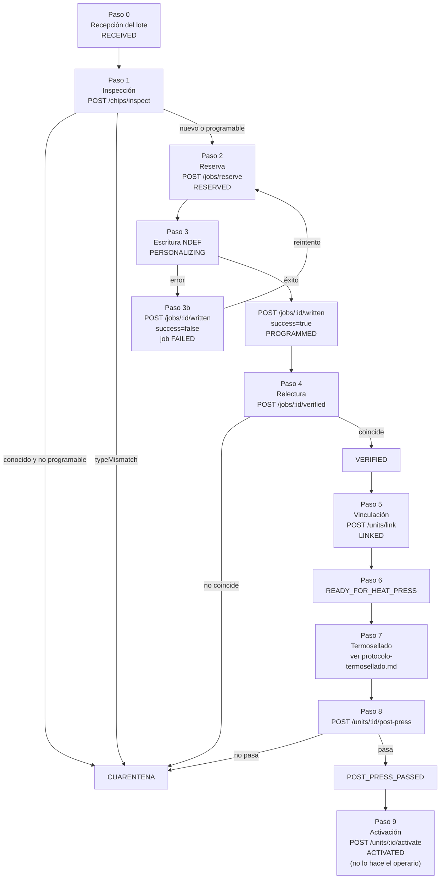

# Protocolo de programación en planta

Procedimiento operativo del puesto de programación NFC. Está escrito para
ejecutarse en la línea, no para leerse una vez.

Corresponde a las rutas de `apps/api/src/routes/production.ts`, a la máquina de
estados de `packages/domain/src/states.ts` y al proveedor
`packages/nfc-contracts/src/providers/ntag21x.ts`.

> **Estado.** La API de producción está implementada. La app Android que la
> consume (`apps/nfc-android`) **no se ha compilado ni probado** y el proveedor
> por defecto del entorno de ejemplo es el simulador (`NFC_PROVIDER=mock`). Este
> protocolo describe el procedimiento previsto; su validación en planta está
> pendiente. Ver [limitaciones.md](limitaciones.md).

---

## 1. Antes de empezar: qué garantiza la API y qué no

| Garantía | Cómo se consigue |
|---|---|
| Un reintento no programa dos veces el mismo chip | Toda operación de escritura exige la cabecera `Idempotency-Key` y pasa por `runIdempotent` |
| Un chip activado no vuelve a estado programable | Las transiciones se validan contra `CHIP_TRANSITIONS`; un salto no declarado devuelve 409 y no se ejecuta |
| El token grabado no queda en la base de datos | Se genera en el servidor, viaja una sola vez dentro de `targetUri` y se guarda solo su hash |
| El teléfono nunca recibe una clave | `keyReferences` va siempre vacío en la respuesta de reserva |
| El servidor comprueba la relectura, no solo el teléfono | En `/jobs/:jobId/verified` se compara `readBackUri` contra el `targetUri` que el servidor ordenó grabar |

Lo que **no** garantiza nada de esto: que el chip sea auténtico o inclonable. Una
NTAG 213/215/216 solo **identifica**. La programación correcta no cambia eso. Ver
[arquitectura.md](arquitectura.md) y [modelo-amenazas.md](modelo-amenazas.md).

---

## 2. Preparación del puesto

Lista de comprobación de apertura de turno. Si algo falla, el puesto no abre.

| # | Comprobación | Criterio |
|---|---|---|
| 1 | Superficie limpia, seca y despejada | Sin herramientas metálicas sueltas sobre la zona de lectura |
| 2 | Iluminación suficiente para leer el código del emblema a simple vista | — |
| 3 | Dos bandejas físicamente separadas y rotuladas: **EN PROCESO** y **CUARENTENA** | La bandeja de cuarentena nunca está junto a la de producto conforme |
| 4 | Teléfono autorizado con batería por encima del 50 % y cargador disponible | Una sesión de planta dura 4 h; un apagado a mitad de trabajo obliga a reconciliar estados |
| 5 | Conectividad con la API confirmada | La app debe poder consultar `GET /production/orders` antes de tocar un chip |
| 6 | Orden de producción abierta y asignada al puesto | Estado `OPEN` o `IN_PROGRESS`. En `DRAFT`, `PAUSED`, `COMPLETED` o `CANCELLED` la reserva se rechaza |
| 7 | Lote de chips identificado y su `batchCode` a la vista | El lote se declara en cada reserva |
| 8 | Registro de lote en papel o pantalla, preparado para anotar | Ver 8 |
| 9 | Banner de simulación **ausente** | Ver 3.3 |

Separación de funciones: el operario **no** puede activar comercialmente ni
revocar. `PRODUCTION_OPERATOR` tiene `production:write` y
`production:quarantine`, y carece de `production:activate` y `production:revoke`.
Ver [matriz-roles-permisos.md](matriz-roles-permisos.md).

---

## 3. Verificación del teléfono autorizado

### 3.1 Qué comprueba el servidor

`POST /api/v1/production/auth/login` exige tres datos: correo, contraseña y
`deviceId`. Después:

1. Busca el usuario. Si no existe, está inactivo o está borrado, consume tiempo
   con `burnTime` y responde igual que ante una contraseña incorrecta. La
   respuesta no distingue los dos casos.
2. Verifica la contraseña con Argon2id.
3. Busca el `deviceId` en `AuthorizedDevice`. **Debe existir y estar activo.**
4. Si el dispositivo no está registrado o está inactivo, escribe una entrada de
   auditoría `production.login.device_rejected` con el motivo (`no registrado` o
   `inactivo`) y responde 403 con el mensaje: *"Este teléfono no está autorizado
   para programar. Avise al supervisor."*
5. Si todo encaja, crea la sesión con `deviceId` asociado y actualiza
   `lastSeenAt` del dispositivo.

Un operario válido en un teléfono no autorizado **no puede programar**. Es el
control que impide usar un dispositivo personal o robado.

### 3.2 Límite honesto de este control

La autorización del dispositivo es **una lista en base de datos**, no una
atestación criptográfica. `AuthorizedDevice.attestationRef` está preparado para
Play Integrity API y **hoy no se verifica**. Consecuencia: quien conozca un
`deviceId` válido puede presentarlo desde otro teléfono. El `deviceId` debe
tratarse como un dato interno y no escribirse en etiquetas visibles del equipo.
Ver el vector "dispositivo de producción comprometido" en
[modelo-amenazas.md](modelo-amenazas.md).

### 3.3 Banner de simulación

La respuesta de inicio de sesión incluye `provider.simulated`. Cuando vale `true`,
la app muestra un **banner permanente**. Regla de planta sin excepciones:

> Si el banner de simulación está visible, no se programa producto destinado a
> venta. Lo que salga de ese turno es material de prueba y debe rotularse como
> tal.

En producción esto no debería poder ocurrir: `apps/api/src/config.ts` **impide el
arranque** si `NFC_PROVIDER=mock` y el entorno es producción. El banner cubre el
caso de un despliegue de pruebas mal etiquetado.

### 3.4 Duración de la sesión

La sesión del dispositivo de planta dura **4 h**, frente a 12 h del panel. Es un
dispositivo compartido y expuesto: si se extravía, la ventana de abuso debe ser
pequeña. Al caducar hay que volver a iniciar sesión; los trabajos en curso no se
pierden, porque su estado vive en el servidor.

---

## 4. Secuencia paso a paso

Estados del chip en el recorrido feliz:

```
RECEIVED → VALIDATED → RESERVED → PERSONALIZING → PROGRAMMED → VERIFIED
        → LINKED → READY_FOR_HEAT_PRESS → POST_PRESS_PASSED → ACTIVATED
```



### Paso 0 — Recepción del lote (`RECEIVED`)

No lo hace el operario del puesto, sino quien recibe la mercancía. Se registra el
`ProductionBatch` con `code`, `supplierName` y `supplierLotRef`. Conservar la
documentación del proveedor: es la única trazabilidad hacia atrás si aparece un
chip anómalo.

### Paso 1 — Inspección del chip (`VALIDATED`)

`POST /api/v1/production/chips/inspect` con `uid` y `chipType` detectado.

Es la primera barrera contra programar dos veces el mismo chip. La respuesta
incluye:

| Campo | Significado |
|---|---|
| `known` | El UID ya está registrado |
| `state` | Estado actual del chip registrado |
| `canProgram` | Verdadero solo si el estado es `VALIDATED`, `RESERVED`, `PERSONALIZING` o `PROGRAMMED` |
| `typeMismatch` | El tipo registrado no coincide con el detectado |
| `message` | Texto para el operario |

Decisión del operario:

| Respuesta | Acción |
|---|---|
| `known: false` | Continuar. Chip nuevo |
| `known: true`, `canProgram: true` | Continuar. Es un reintento legítimo |
| `known: true`, `canProgram: false` | **Cuarentena.** El chip ya está en un estado posterior; no debe reprogramarse |
| `typeMismatch: true` | **Cuarentena.** El chip físico no es el que se cree |

### Paso 2 — Reserva y plan de escritura (`RESERVED`)

`POST /api/v1/production/jobs/reserve` con `Idempotency-Key`, `orderId`, `uid`,
`chipType` y `batchCode`.

El servidor, en este orden:

1. Comprueba que la orden esté en `OPEN` o `IN_PROGRESS`.
2. Rechaza `NTAG424DNA` si el despliegue no tiene ese proveedor habilitado, antes
   de reservar nada.
3. Genera el `tagToken` y construye `targetUri`.
4. Comprueba con `checkUriFits` que la URL **cabe** en el tipo de chip. Si no
   cabe, devuelve 400 indicando bytes requeridos y disponibles.
5. Da de alta o recupera el chip por UID, valida la transición a `RESERVED`,
   guarda el hash del token y crea el `PersonalizationJob`.
6. Si la orden estaba en `OPEN`, la pasa a `IN_PROGRESS`.
7. Audita `production.chip.reserved`.

Respuesta: `jobId`, `chipId`, `targetUri`, `providerId`, `simulated`, `lockPlan`
(con ambos campos en `false`, ver 6) y `keyReferences` vacío.

**El `targetUri` contiene el token en claro y solo se entrega aquí.** Si se pierde
la respuesta, no se recupera: hay que reservar de nuevo con una clave de
idempotencia nueva.

### Paso 3 — Escritura NDEF (`PERSONALIZING` → `PROGRAMMED`)

El teléfono ejecuta `writeNdef` del proveedor con el plan recibido. El proveedor
NTAG 21x, antes de escribir, rechaza en tres casos: chip ya bloqueado
(`TAG_READ_ONLY`), URI que no cabe (`INSUFFICIENT_MEMORY`) y plan con referencias
de clave sobre un chip que no las admite (`OPERATION_NOT_PERMITTED`).

Instrucción física: **apoyar el emblema y no moverlo hasta la confirmación
audible.** La causa más frecuente de `TAG_LOST` es retirar el teléfono antes de
tiempo.

Después se reporta el resultado con
`POST /api/v1/production/jobs/:jobId/written` y `Idempotency-Key`:

| Cuerpo | Efecto en el chip | Efecto en el trabajo |
|---|---|---|
| `success: true` + `writtenPayloadHash` | `PROGRAMMED`, `programmedAt` fijado | `WRITTEN`, `attempts` +1 |
| `success: false` + `errorCode` | Sin cambio de estado | `FAILED`, `lastError`, `attempts` +1 |

Un fallo de escritura es **siempre reintentable**: el chip no quedó en estado
final. La respuesta lo indica con `canRetry: true`.

Solo el operario que reservó el trabajo puede reportarlo: si `operatorId` no
coincide, la API devuelve 403.

### Paso 4 — Relectura de comprobación (`VERIFIED`)

El teléfono ejecuta `verifyPersonalization`, que relee la memoria de usuario,
decodifica el registro URI y compara con el plan. Después se reporta con
`POST /api/v1/production/jobs/:jobId/verified`, enviando `matches` y
`readBackUri`.

**El servidor no se fía del `matches` del teléfono.** Comprueba por su cuenta que
`readBackUri` sea exactamente el `targetUri` que ordenó grabar. Se acepta solo si
ambas condiciones son verdaderas.

| Resultado | Chip | Trabajo | `lastError` |
|---|---|---|---|
| Aceptado | `VERIFIED`, `verifiedAt` fijado | `VERIFIED`, `completedAt` | — |
| Cliente dice que coincide, servidor no | **`QUARANTINED`** | `FAILED` | `VERIFY_MISMATCH_SERVER` |
| Cliente dice que no coincide | **`QUARANTINED`** | `FAILED` | `VERIFY_MISMATCH_CLIENT` |

La cuarentena es **automática** y no requiere decisión del operario. Motivo: una
escritura parcial produce una etiqueta que parece válida y no lo es.
`VERIFY_MISMATCH_SERVER` es el caso más grave: el teléfono afirmó una cosa y el
servidor leyó otra. Debe escalarse al supervisor, no solo apartarse.

### Paso 5 — Vinculación chip / emblema / unidad (`LINKED`)

`POST /api/v1/production/units/link` con `Idempotency-Key`, el `jobId` y el
`skuCode`. El servidor busca el SKU por `code`; si no existe, 404. Crea o
recupera el emblema y la `JerseyUnit`, genera `publicRef` y `qrToken`, y deja el
chip en `LINKED`.

Comprobación física obligatoria antes de enviar: **el código impreso del emblema
que tiene en la mano es el que va a vincular.** Un emblema vinculado al SKU
equivocado produce un jersey cuya ficha no corresponde a la prenda, y el error
solo se detecta cuando el aficionado lo lee.

### Paso 6 — Preparación para la prensa (`READY_FOR_HEAT_PRESS`)

Transición administrativa. A partir de aquí manda
[protocolo-termosellado.md](protocolo-termosellado.md).

### Paso 7 y 8 — Termosellado y comprobación posterior (`POST_PRESS_PASSED`)

Tras la prensa, `POST /api/v1/production/units/:unitId/post-press` con
`readable`, `contentIntact` y los parámetros de la receta (`temperatureC`,
`pressureBar`, `durationSec`).

`passed = readable && contentIntact`.

| `passed` | Chip | Unidad |
|---|---|---|
| `true` | `POST_PRESS_PASSED` | `READY` |
| `false` | **`QUARANTINED`** | `QUARANTINED` |

Se crea siempre un `PostPressCheck`, también cuando falla, con la marca
`simulated` y los parámetros de la prensa. Los parámetros permiten correlacionar
fallos con la receta: si todos los fallos de un turno comparten temperatura, el
problema es la receta y no los chips.

### Paso 9 — Activación comercial (`ACTIVATED`)

`POST /api/v1/production/units/:unitId/activate`. Exige
`production:activate`, que el operario **no tiene**. La ejecuta un
`MARATHON_ADMIN` o el sistema de la tienda al vender. Ver
[integracion-tienda.md](integracion-tienda.md).

La transición se valida: solo se activa lo que superó el control posterior al
calor. En la activación se crea el `DigitalCertificate` si no existía, con
`signature: null`, porque **la firma con clave custodiada está pendiente**. Ver
[plan-gestion-claves.md](plan-gestion-claves.md).

Hasta la activación, una lectura pública devuelve `NOT_ACTIVATED` y suma 15 puntos
de riesgo: un emblema robado de la línea no produce un veredicto favorable.

---

## 5. Qué hacer ante cada error

Códigos de `NFC_ERROR_CODES` con el mensaje al operario de `OPERATOR_MESSAGES`.

| Código | Mensaje al operario | ¿Reintentar? | Acción |
|---|---|---|---|
| `TAG_LOST` | "Se perdió el contacto. Mantenga el emblema apoyado sin moverlo hasta que suene." | Sí | Reintentar apoyando sin mover. Tres fallos seguidos: cuarentena |
| `TAG_READ_ONLY` | "Este chip ya está bloqueado y no admite escritura. Aparte la unidad." | No | **Cuarentena.** Un chip bloqueado de fábrica o previamente bloqueado no es utilizable |
| `TAG_NOT_NDEF` | "El chip no tiene el formato esperado. Aparte la unidad y avise al supervisor." | No | **Cuarentena + aviso.** Puede indicar un chip no genuino en el lote |
| `TAG_TYPE_UNSUPPORTED` | "Este tipo de chip no corresponde a esta orden. Verifique el lote." | No | Detener el puesto y verificar el lote completo. Si el lote está mezclado, es un problema del proveedor |
| `INSUFFICIENT_MEMORY` | "El chip no tiene memoria suficiente. Verifique el modelo del lote." | No | **Detener el puesto.** Suele ser configuración: `FAN_WEB_PUBLIC_URL` demasiado larga para el tipo de chip. Avisar a ingeniería, no seguir probando chips |
| `WRITE_FAILED` | "No se pudo grabar. Retire el teléfono, vuelva a acercarlo e intente de nuevo." | Sí | Hasta 3 intentos. Después, cuarentena |
| `VERIFY_MISMATCH` | "La comprobación posterior no coincide. La unidad pasa a cuarentena automáticamente." | No | Ya está en cuarentena. Anotar en el registro de lote |
| `AUTH_FAILED` | "El chip rechazó la operación de seguridad. Aparte la unidad." | No | **Cuarentena.** No aplica a NTAG 21x, que no ejecuta operaciones de seguridad |
| `TRANSPORT_ERROR` | "Error de comunicación con el chip. Intente nuevamente." | Sí | Reintentar. Si se repite en varios chips seguidos, el problema es el teléfono |
| `NOT_IMPLEMENTED` | "Esta operación no está disponible en este equipo." | No | No es un fallo de la unidad. Avisar a ingeniería. Es lo que devuelve el bloqueo, ver 6 |
| `OPERATION_NOT_PERMITTED` | "No tiene autorización para esta operación." | No | Revisar el rol y el ámbito del operario |

Errores de la API, no del chip:

| Situación | Respuesta | Acción |
|---|---|---|
| Falta `Idempotency-Key` o es inválida | 400 | Defecto de la app. Avisar a ingeniería |
| Transición de estado no declarada | 409 | La unidad no está donde el operario cree. Consultar su estado antes de insistir |
| Trabajo de otro operario | 403 | Cada operario cierra sus propios trabajos |
| Orden en estado no productivo | 400 | Confirmar la orden asignada con el supervisor |
| SKU inexistente en la vinculación | 404 | Corregir el `skuCode`; no inventar uno que exista |
| Sesión caducada (4 h) | 401 | Volver a iniciar sesión. Los trabajos siguen en el servidor |
| Sin conectividad | — | **Detener el puesto.** No hay modo fuera de línea: sin servidor no hay token, y un token generado en el teléfono no sería verificable |

Regla general: **ante la duda, cuarentena.** Apartar una unidad conforme cuesta
una inspección. Dejar pasar una no conforme cuesta la credibilidad del sistema.

---

## 6. Bloqueo

### 6.1 No está implementado

`lockAllowedAreas` del proveedor NTAG 21x devuelve éxito solo cuando no se pide
nada (`lockNdefReadOnly: false` y `lockConfiguration: false`). Si se pide
cualquier bloqueo real, devuelve el error `NOT_IMPLEMENTED` con el detalle:

> *El bloqueo irreversible de NTAG 21x no está implementado: requiere validación
> con hardware real.*

Coherentemente, `POST /jobs/reserve` emite siempre un `lockPlan` con los dos
campos en `false`. La capacidad del proveedor declara `canLockMemory: true`
porque **el chip sí lo admite**; lo que no está implementado es el adaptador.

### 6.2 Por qué no se implementó a ciegas

Escribir los lock bytes o los lock bits de una NTAG 21x es **irreversible**. No
hay comando de desbloqueo: un bit puesto no se quita. Un error de offset
—escribir en la página equivocada— **inutiliza el chip de forma permanente**, y
lo hace sobre un emblema que ya está cosido o a punto de coserse a una prenda
terminada.

El coste de equivocarse no es un reintento: es la prenda. Y el error no aparece
en pruebas con el simulador, porque el simulador no tiene lock bytes; aparece en
el primer lote real, y hasta ese momento el código parece correcto.

Además, el mapa de memoria y la disposición exacta de los bits de bloqueo varían
entre NTAG 213, 215 y 216. Implementarlo requiere validarse contra chips reales
**de cada familia**, con chips sacrificados a propósito.

### 6.3 Qué implica no bloquear

Hay que decirlo sin rodeos: **el contenido NDEF es reescribible por cualquier
teléfono con NFC.** Quien tenga la prenda en la mano puede sobrescribir la URL del
chip.

| Consecuencia | Efecto real | Mitigación existente |
|---|---|---|
| Sobrescribir la URL con otra | La lectura deja de resolver al token registrado | Se registra un `VerificationEvent` con token desconocido. La unidad deja de verificar, lo que es visible y perjudica a quien lo hizo, no a Marathon |
| Copiar la URL a otra etiqueta | Dos etiquetas idénticas circulando | Señales blandas del motor de riesgo: lecturas frecuentes, dispositivos e IP distintas. **No es detección fiable** |
| Bloquear el chip por cuenta propia | El chip queda de solo lectura | `inspectTag` lo detecta con el sondeo de solo lectura y `preparePersonalization` lo rechaza |

El bloqueo **no resolvería** el problema de fondo. Una NTAG 21x bloqueada sigue
siendo copiable: su contenido es legible y se puede escribir en otra etiqueta. El
bloqueo elevaría el coste de la manipulación, no la impediría. La solución real
para anticlonación es criptográfica y pasa por NTAG 424 DNA. Ver
[guia-ntag424-dna.md](guia-ntag424-dna.md) y
[piloto-a-produccion.md](piloto-a-produccion.md).

### 6.4 Si se decide implementarlo

Requisitos mínimos, en orden:

1. Hoja de datos oficial de NXP de **cada** familia a usar, verificando el mapa de
   memoria y la disposición de lock bytes y lock bits contra el documento, no
   contra ejemplos de internet.
2. Al menos 20 chips de cada familia **destinados a ser destruidos**.
3. Implementación con una prueba previa de solo lectura que confirme el offset
   calculado antes de escribir nada.
4. Un interruptor de configuración, por defecto desactivado, y registro de
   auditoría de cada bloqueo.
5. Validación en un lote piloto pequeño y físicamente segregado.
6. Actualización de este documento con los resultados medidos.

Mientras eso no exista, `lockPlan` se mantiene en `false` y el proveedor devuelve
`NOT_IMPLEMENTED`. Es la conducta correcta: fallar de forma visible en lugar de
destruir chips en silencio.

---

## 7. Criterios de cuarentena

### 7.1 Cuarentena automática

La aplica el servidor sin intervención:

| Disparador | Estado resultante |
|---|---|
| Relectura que no coincide con el `targetUri` del servidor | `QUARANTINED` |
| `matches: false` reportado por el teléfono | `QUARANTINED` |
| Prueba posterior al termosellado no superada | `QUARANTINED` (chip y unidad) |

### 7.2 Cuarentena por decisión del operario

`POST /api/v1/production/units/:unitId/quarantine` con un `reason` de entre 3 y
500 caracteres. **El motivo es obligatorio**: una cuarentena sin motivo no se
puede resolver después.

Motivos que exigen cuarentena:

| Situación | Motivo |
|---|---|
| Chip conocido con `canProgram: false` | Ya está en un estado posterior |
| `typeMismatch: true` | El chip físico no es el declarado |
| Tres fallos de escritura seguidos sobre el mismo chip | Comportamiento errático |
| Emblema con daño físico visible: doblez, delaminación, chip palpable desplazado | — |
| Emblema cuyo código impreso es ilegible o no coincide con el registro | Trazabilidad rota |
| Chip que responde con UID distinto al de la inspección | Señal de manipulación |
| Duda razonable del operario | Se anota "duda del operario" y qué se observó |

### 7.3 Escalada inmediata al supervisor

Estas no son cuarentenas de rutina. Detienen el puesto:

- `VERIFY_MISMATCH_SERVER`: el teléfono afirmó una cosa y el servidor leyó otra.
- `TAG_NOT_NDEF` o `TAG_TYPE_UNSUPPORTED` en más de un chip del mismo lote.
- `INSUFFICIENT_MEMORY`: es un defecto de configuración, no del chip.
- Cualquier UID que aparezca **duplicado** en el mismo lote. El UID es único en
  `NfcChip`: un duplicado significa etiquetas con UID escribible o emuladores, y
  compromete la confianza en todo el lote.

### 7.4 Resolución

Solo desde `QUARANTINED`, y solo por un rol con permiso. Las salidas declaradas
son `VALIDATED`, `RESERVED`, `LINKED`, `ACTIVATED`, `REVOKED` y `DESTROYED`.

| Decisión | Cuándo | Quién |
|---|---|---|
| Rehabilitar a `VALIDATED` o `RESERVED` | Causa identificada y descartada, p. ej. mala colocación del teléfono | Supervisor con `production:write` |
| Rehabilitar a `LINKED` o `ACTIVATED` | La unidad estaba más avanzada y la anomalía era administrativa | `MARATHON_ADMIN` |
| `REVOKED` | La unidad no debe circular y se conserva para análisis | `MARATHON_ADMIN` (`production:revoke`) |
| `DESTROYED` | Destrucción física, registrada | `MARATHON_ADMIN`, con testigo |

La fila del chip **nunca** se borra. Un chip destruido cuyo registro desapareciera
dejaría un UID reutilizable sin rastro. Ver
[modelo-datos.md](modelo-datos.md).

Regla de destrucción: la destrucción física es efectiva solo si inutiliza el chip,
no solo el emblema. Cortar el emblema por la mitad sin dañar el módulo deja un
chip funcional en la basura.

---

## 8. Control por lote

### 8.1 Registro por lote

Una fila por lote, con el `ProductionBatch.code` como clave:

| Campo | Fuente |
|---|---|
| Código de lote | `ProductionBatch.code` |
| Proveedor y referencia de lote del proveedor | `supplierName`, `supplierLotRef` |
| Tipo de chip declarado | Documentación del proveedor |
| Cantidad recibida | Conteo físico, no albarán |
| Fecha de recepción y responsable | — |
| Orden de producción en la que se consume | `ProductionOrder.code` |
| Unidades programadas, verificadas, en cuarentena, destruidas | Conteo del turno |
| Incidencias | Texto libre, con UID afectados |

### 8.2 Inspección de entrada por muestreo

Antes de consumir un lote, sobre una muestra:

1. Leer el UID y confirmar que el tipo detectado coincide con el declarado.
2. Comprobar que no hay UID duplicados en la muestra.
3. Confirmar que ningún chip llega ya bloqueado (`inspectTag` con `readOnly`).
4. Confirmar que ningún chip llega con un NDEF previo inesperado.

El tamaño de muestra, el nivel de aceptación y la frecuencia deben fijarse con el
plan de calidad de la planta y **no se inventan aquí**. Ver
[pruebas-fisicas.md](pruebas-fisicas.md) para el protocolo de ensayos físicos, que
sí incluye números de muestra propuestos.

### 8.3 Marcado de lote

`ProductionBatch.flagged` lo pone control de calidad o el motor de riesgo, y **el
motor de riesgo lo lee en cada verificación**: un lote marcado suma 20 puntos de
riesgo (`BATCH_ANOMALY_FLAGGED`) a todas las unidades que provienen de él.

Criterios para marcar un lote:

- UID duplicados detectados.
- Más de un chip con `TAG_NOT_NDEF` o `TAG_TYPE_UNSUPPORTED`.
- Tasa de cuarentena del lote por encima del umbral acordado con calidad.
- Cualquier sospecha sobre la cadena de suministro.

Marcar un lote es una decisión con consecuencias sobre producto ya vendido:
degrada el veredicto de unidades en manos de aficionados. Debe tomarla un
`MARATHON_ADMIN`, con motivo escrito y aviso a soporte, no el puesto.

### 8.4 Indicadores del turno

| Indicador | Cálculo | Para qué |
|---|---|---|
| Tasa de primer intento | Chips con una sola escritura / total | Salud del puesto y del operario |
| Tasa de cuarentena | Unidades en cuarentena / total | Salud del lote |
| Reintentos por chip | `PersonalizationJob.attempts` | Detectar un teléfono degradado |
| Fallos por código de error | Agrupación de `lastError` | Distinguir problema de chip, de teléfono o de configuración |
| Trabajos `FAILED` sin resolver | Consulta de `GET /production/me/history` | Cierre de turno: no debe quedar ninguno sin decisión |

`GET /api/v1/production/me/history` devuelve los trabajos recientes del operario.
Es la herramienta de cierre de turno.

---

## 9. Cierre de turno

| # | Comprobación |
|---|---|
| 1 | Ningún trabajo en `PENDING` o `IN_PROGRESS`. Todo reservado está reportado |
| 2 | Ningún chip en `PERSONALIZING`. Es un estado transitorio con expiración; si queda alguno, se reconcilia |
| 3 | Toda unidad de la bandeja de cuarentena tiene su `reason` registrado en la API |
| 4 | Conteo físico de la bandeja de cuarentena igual al conteo del sistema |
| 5 | Registro de lote actualizado con los conteos del turno |
| 6 | Incidencias escaladas, no solo anotadas |
| 7 | Sesión cerrada en el teléfono y el teléfono guardado bajo llave |

Discrepancia entre el conteo físico y el del sistema: **es una incidencia de
seguridad**, no un error administrativo. Un emblema programado que no está en la
bandeja está en otro sitio. Se escala el mismo día.

---

## 10. Documentos relacionados

- [protocolo-termosellado.md](protocolo-termosellado.md)
- [pruebas-fisicas.md](pruebas-fisicas.md)
- [guia-ntag424-dna.md](guia-ntag424-dna.md)
- [modelo-amenazas.md](modelo-amenazas.md)
- [modelo-datos.md](modelo-datos.md)
- [matriz-roles-permisos.md](matriz-roles-permisos.md)
- [integracion-tienda.md](integracion-tienda.md)
- [limitaciones.md](limitaciones.md)
